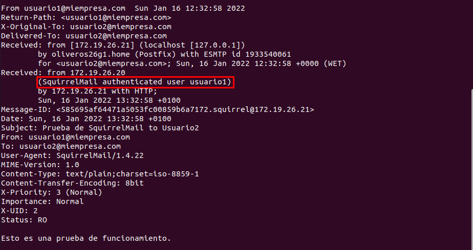

# Informe Instalación y Configuración de un Servidor de Correo Electrónico en Linux

## MÁQUINAS

|  MV | Hostname  | IP  |
|---|---|---|
| Servidor  | oliveros26g1  | 172.19.26.21  |
| Cliente  |  oliveros26g2 | 172.19.26.20  |

## SMTP
#### Instalar servicio SMTP en Linux, utilizando el servidor Postfix.

**Descargar e instalar postfix**

```
sudo apt install postfix
```


**Configuración de postfix**

- Escoger instalación como `Sitio de Internet`


- Crear dominio `miempresa.com`


**Comprobar servicio (y puerto) SMTP activo y a la escucha con netstat –utap**

- Servicio y Puerto


- Escucha con `netstat -utap`


**Realizar una prueba de envío de mensaje entre dos usuarios del sistema mediante telnet**

*Seguimos la guia del PDF que nos ofrece el profesor*


- Buscamos en `/var/spool/mail/usuario-destinatario` el correo enviado.


**Instalar un cliente de correo electrónico en un cliente (Evolution)**

En la MV Cliente (172.19.26.20)

- Instalamos el cliente con el comando:

```
sudo apt install evolution

```


**Crear dos nuevas entradas en /etc/hosts: smtp.miempresa.com y pop.miempresa.com asociadas a la IP del servidor.**


**Crear al menos dos cuentas asociadas a usuarios existentes en el servidor y asociadas al dominio creado en Postfix.**

- Volvemos al Evolution en la MV Cliente:

- Creamos dos cuentas utilizando dos usuarios existentes en el sistema, en mi caso he utilizado tres: `Robert`, `usuario1` y `usuario2`.


- Ejemplo de configuración de una cuenta:


- No tenemos servicio de recepción de correo por ahora así que elegimos ninguno.


- Definimos el servicio `SMTP`.


> Hacemos lo mismo con las otras cuentas.


**Realizar envío de dos correos, uno con cada una de las cuentas creadas. Comprobar la recepción de estos correos en el servidor examinando la carpeta /var/mail.**

- `Robert` To `Usuario1`


- `Robert` To `Usuario2`


- Bandeja de correos enviados del usuario `robert`


## IMAP

#### Instalar servicio IMAP y servidor Correo Web SquirrelMail

**Instalar servicio IMAP**

```
sudo apt install dovecot-imapd

```


**Comprobar servicio (y puerto) IMAP activo y a la escucha con netstat –utap**

- Servicio y Puerto


- Escucha con `netstat -utap`


**Instalar aplicación correo web SquirrelMail**

- Lo instalaremos desde su página web y utilizaremos estos comandos:

```
#Descargamos el archivo desde la página web
wget https://sourceforge.net/projects/squirrelmail/files/stable/1.4.22/squirrelmail-webmail-1.4.22.zip

#Descomprimimos el paquete
unzip squirrelmail-webmail-1.4.22.zip

#Movemos el contenido a la carpeta /var/www/html/
sudo mv squirrelmail-webmail-1.4.22 /var/www/html/

#Cambiamos el propietario y permisos del contenido
sudo chown -R www-data:www-data /var/www/html/squirrelmail-webmail-1.4.22/
sudo chmod 755 -R /var/www/html/squirrelmail-webmail-1.4.22/

#Cambiamos el nombre de la carpeta para hacerlo más sencillo
sudo mv /var/www/html/squirrelmail-webmail-1.4.22/ /var/www/html/squirrelmail
```
- Una vez ejecutado los comandos, ejecutaremos este último para lanzar el script de configuracion:

```
sudo perl /var/www/html/squirrelmail/config/conf.pl
```
- Elegimos la opcion 2 "`Server Settings`"


- Cambiamos el nombre del dominio en la opción 1 "`Domain`"


- Guardamos y volvemos al menu principal


- Elegimos la opción 4 "`General Options`"


- Cambiaremos esas dos rutas, ya que en los comandos que hemos ejecutado antes, movíamos el contenido a la carpeta `/var/www/html/`


> El allow server-side sorting recomendaban activarlo para un mejor funcionamiento y evitar errores.

**Acceder vía HTTP en /localhost/squirrelmail**


**Acceder desde una máquina cliente, vía HTTP, al gestor de correo SquirrelMail instalado**


**Enviar y recibir correos entre las dos cuentas creadas desde el cliente y utilizando el gestor de correo web SquirrelMail**

- Iniciamos sesión tanto en cliente como servidor con un usuario distinto.

Cliente: Usuario1


> Vemos como nos aparecen tanto el primero correo de prueba que hicimos vía `telnet` como el correo que hicimos con el` Evolution`.

Servidor: Usuario2


> Vemos como nos aparece el correo de prueba que recibimos en la parte del `Evolution`.

- Enviamos del servidor(`usuario2`) al cliente(`usuario1`)


- Recibido!


- Enviamos del cliente(`usuario2`) al servidor(`usuario2`)


- Recibido!


**Comprobar que los mensajes enviados desde ambas cuentas se siguen encontrando en los respectivos buzones de los usuarios en /var/mail**




## POP3

**Instalar servicio POP3**

```
sudo apt install dovecot-pop3d

```


**Comprobar servicio (y puerto) POP3 activo y a la escucha con netstat –utap**

- Servicio y Puerto


- Escucha con `netstat -utap`


**Configurar MUA en máquina cliente para que acceda a la recepción de correo a través del protocolo POP3 instalado en el servidor**

- Volvemos al Evolution y borramos las cuentas para crearlas tanto con `SMTP` como con `POP3`


- Ejemplo de creación con ambos protocolos.


- Ya tenemos las dos cuentas.


**Enviar y recibir correos entre las dos cuentas creadas desde el cliente y utilizando el gestor de correo del cliente**

- Enviamos un mensaje de `Robert` To `Usuario1`


**Comprobar que los correos enviados y recibidos han desaparecido (han sido extraídos por POP3) de los buzones respectivos de los usuarios en /var/mail**

- En este caso, se ve que las nuevas versiones del protocolo `POP` no eliminan los correos enviados o recibidos.


