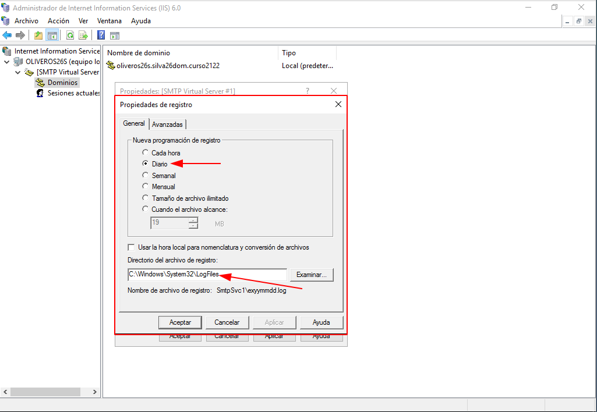
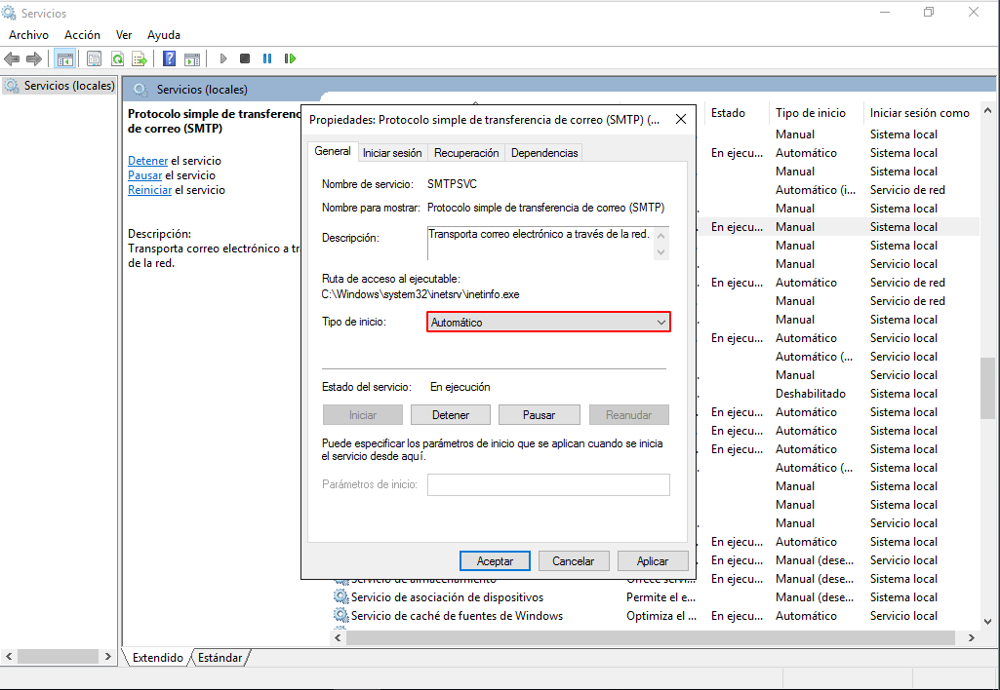
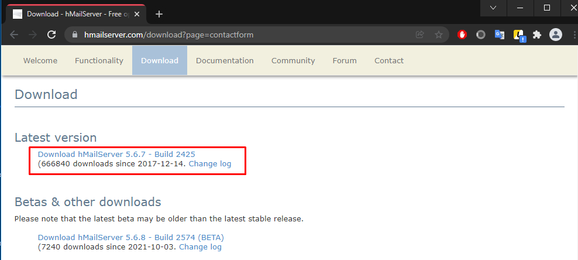
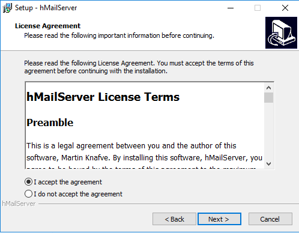
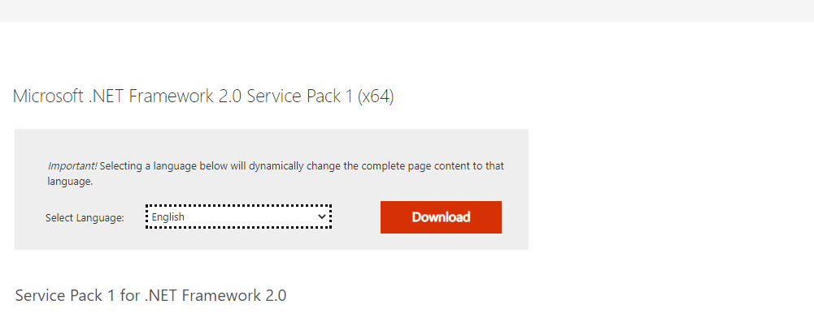
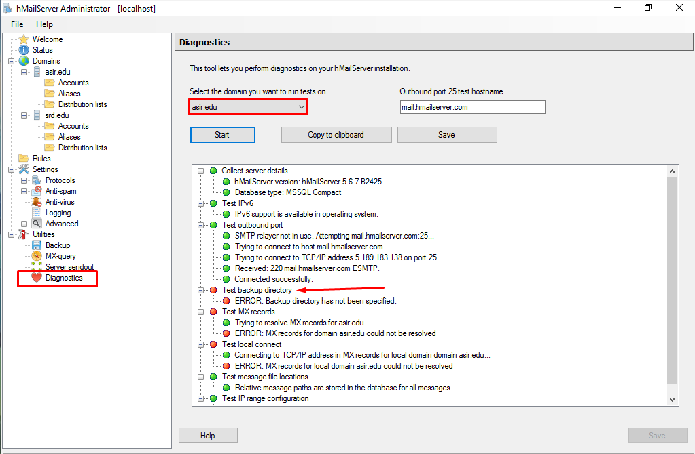
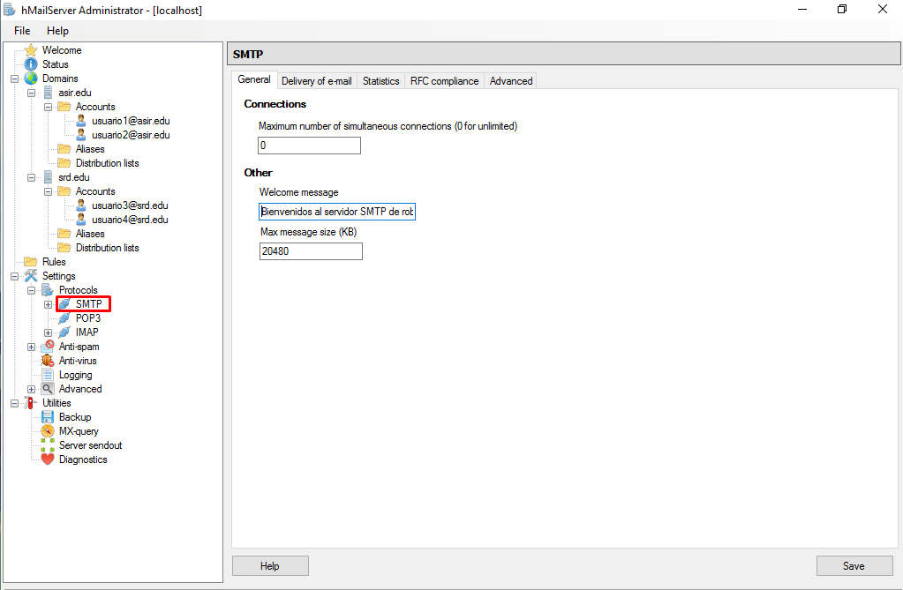
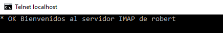
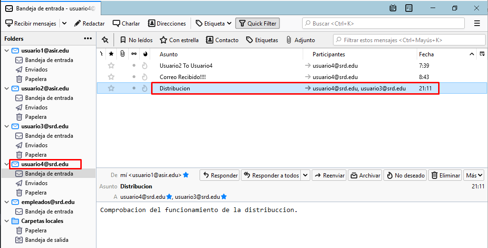

# Instalación y Configuración de Servicios de Correo Electrónico en Windows 2016 Server

#### PLANTEAMIENTO
- Instalar y configurar el servicio `SMTP` en Windows 2016 Server, una vez hecho, desinstalamos este servicio e instalamos el servidor de correo `hMailServer` y lo configuraremos.

## Servicio SMTP Windows 2016 Server

#### Instalar Servicio SMTP en Windows 2016 Server.
- Vamos a `agregar roles y características` y avanzamos hasta `Características`.

- Marcamos la opción de `Servidor SMTP`.

> Esperamos a que finalice la instalación.

- Podemos comprobar que ya contamos con el servicio: `Herramientas` > `Administrador de Internet Information Services (IIS) 6.0`

#### Configuración de servicio SMTP a través del administrador de aplicaciones (IIS) 6.0.

###### En el servidor:

Realizar las siguientes acciones de configuración:
 - Establecer como IP todas las asignadas
 - Limitar el número de conexiones a 50
 - Habilitar el registro en formato W3C, diario y en una carpeta determinada

> En mi caso, la carpeta que he elegido es: LogFiles

 - Establecer `autenticación anónima`.

- Configurar envío de mensajes dentro de nuestra red local: Aceptar la conexión al servidor y la retransmisión de mensajes a todos los equipos menos los que aparecen en la lista (incluir una IP cualquiera en la lista para impedir su acceso y retransmisión)

> En mi caso, he incluido como ejemplo el equipo: 172.19.26.79

- Echar un vistazo al resto de opciones de configuración del servidor. Aplicar cambios y reiniciar servicio.

También podemos configurar el servicio para que este se inicie de forma automática al iniciar el equipo.

- Comprobar la existencia del dominio AD predeterminado. Crea un dominio de tipo alias para disponer de cuentas en otro dominio.

- Creamos el alias '`robertsrd`' en el AD predeterminado.

-  Comprueba carpetas de correo creados en C:\Inetpub\mailroot.

Explicacion de las carpetas:

**Badmail**: Se alojan los mensajes para destinatarios desconocidos.

**Drop**:Se alojan los mensajes entregados.

**Pickup**: Se alojan los nuevos mensajes, que están listos para ser enviados, se suele actualizar cada 5s.

**Queue**: Se alojan los mensajes en cola.

###### En el cliente:

- Comprobar acceso al nuevo nombre DNS creado en el Servidor.

Este es el servicio de correo creado:

> Comprobamos la existencia del servicio de correo mediante un nslookup al alias.

- Descargamos y Configuramos el cliente de correo (`Pegasus`)

Tuvimos que elegir este servicio de correo, ya que no nos pide la verificación de servicio de entrada y salida para la creación de una cuenta.

- Configurar el cliente de correo con una cuenta del AD (alfredo)

Introducimos la IP del servidor.

Saltamos esta opción.

Ya estaria listo.

- Enviar correo a diferentes cuentas (Dentro del AD, fuera del AD, No existente y Real)

**Cuenta AD (julia):**

Vemos como tenemos el mensaje en la carpeta Drop.

**Cuenta No existente (jordan):**

**Cuenta Real (mi cuenta de gmail):**

Podemos verlo en la carpeta de Queue

**Cuenta No AD (noAD):**

**Historial de mensajes:**

- Nueva configuración de servicio `SMTP` a través del administrador de aplicaciones (IIS) 6.0. Establecer autenticación básica de Windows. Probar diferentes configuraciones de dominio predeterminado, cifrado TLS, etc.

Tuve un problema muy particular para intentar activar el cifrado TLS, y que no me reconocía ningún certificado SSL/TLS de los que yo tenía, aunque a otras personas si les reconociera los suyos, que usamos en prácticas anteriores, a mi no me dejaba, incluso cree 2 certificados nuevos y ninguno me lo reconoció.

Teníamos que configurar la autentificación básica y requerir el cifrado TLS.

- Pero como podemos comprobar, la Comunicación segura está deshabilitada porque no se dispone de un certificado.

Si hubiera funcionado, solo tendríamos que haber ido al cliente, y configurar en el Pegasus Mail el uso vía STARTTLS en las opciones de Sending(SMTP).

Si intento enviar algo, me da error, como es logico, ya que tuve el problema de que mi servicio no quería reconocer mis cifrados TLS:

> Podría haber seguido indagando en el problema junto al profesor, pero al tener vacaciones de navidad es tomo mucho más complicado.

## Configuración de hMailServer en Windows Server 2016

#### Desinstalar el servicio SMTP de Windows 2016 Server

#### Descargar e Instalar el servidor de correo hMailServer

- Definimos un password

- Nos indica que necesitamos la dependencia `Microsoft .NET Framework 2.0`

- No me dejaba instalarla, así que probé buscándola por mi cuenta.

- En los docs de Microsoft encontré el framework y me lo descargué.

- Al ejecutarlo daba otro error porque necesitaba unas características, así que las instale.

- Ya podemos finalizar la descarga con normalidad.

- Nos conectamos desde `localhost`.

#### Crea dos dominios denominados srd.edu y asir.edu.

#### Ejecuta los diagnósticos para ambos dominios y soluciona el error de backup asignando una carpeta para tal fin. Establece copia de seguridad de los mensajes.

- Vemos como nos da error en el apartado de test de backups en ambos dominios.

- Creamos un backup asignado a una nueva carpeta.

- Realizamos otra vez los diagnósticos.

#### Crea dos cuentas para dos usuarios ficticios en cada uno de los dos dominios. Investiga y configura las cuentas con diferentes opciones.

**asir.edu**

*Usuario1* que contara con 4GB de memoria máxima y un auto-replay definido para enviar cada vez que reciba un mensaje.

*Usuario2* que contara con un reenvío de los mensajes que reciba al usuario1, sin mantener el mensaje original, es decir, solo llegara la copia.

**srd.edu**

*Usuario3* que contara con una firma definida que aparecerá de forma automática en el mensaje que reciba el receptor del mismo.

*Usuario4*  simplemente cuenta con información personal (no sabía si aparecería en los mensajes, ya que estaba probando un poco todas las funciones que ofrecían de configuración)

#### Configura el servicio DNS para crear las entradas mail.srd.edu y mail.asir.edu que apunten a la dirección ip del servidor.

- Creamos ambas zonas con un host que apunte a la ip del servidor.

- Tambien creamos un registro MX que apunte al FQDN (mail.nombredeldominio)

#### Realiza todas las opciones de configuración que consideres necesarias y/o convenientes.

Con ayuda del video que nos ofrece el profesor he realizado algunas configuraciones como:

- Creamos un mensaje de bienvenida para los diferentes protocolos:

> Para comprobarlo necesitamos descargar Telnet.

Comprobamos el funcionamiento:

`SMTP`

`POP3`

`IMAP`

- Desmarcamos el Auto-Ban así evitaremos que alguna de nuestras cuentas sea bloqueada por tener accesos denegados.

- Creamos un rango de IPs que aceptara nuestro servicio de correos.

- Esta opción me pareció interesante, ya que nos permite configurar una dirección de correo externa donde guardar toda la mensajería que se registre en nuestro hMailServer, pero en mi caso no le di uso.

- También tenemos la lista de distribución que hace llegar a todos los miembros que tenga asignados los correos que recibe, esto sería muy útil por ejemplo en una empresa, así no hay que seleccionar uno por uno a los miembros de la empresa. Esto lo utilizaremos más tarde.

#### Configura en el cliente Windows un cliente de correo como thunderbird o Live Mail.

En mi caso he usado `Thundebird`:

- Entramos con el `usuario1`.

- Seleccionamos el protocolo `IMAP` por ejemplo.

- Nos dará un aviso, ya que estamos usando el servicio sin seguridad (encrypt)

> Marcamos que aceptamos el riesgo.

- Iniciamos con la segunda cuenta de asir.edu

- En este caso podemos elegir el otro protocolo, así probamos los dos.

Hacemos esto con las otras dos cuentas y este será el resultado:

#### Realiza prueba de envío y recepción de correos entre los diferentes usuarios, comprobando, además de envío y recepción correctas, el efecto de las opciones configuradas en las cuentas.

`Del Usuario1 al Usuario3:`

`Del Usuario3 al Usuario1:`

*Recordemos que el `Usuario1` tiene programado un auto-replay y el `Usuario3` una firma que se genera de forma automática*

> Vemos como la firma se ha escrito de forma automática.

> Al `Usuario3` le llega un mensaje programado del Usuario1.

`Del Usuario2 al Usuario4:`

`Del Usuario4 al Usuario2:`

*Recordemos que al `Usuario1` le deberá llegar el mensaje recibido por parte del `Usuario2`, ya que así está configurado*

>Vemos como el `Usuario1` ha recibido el mensaje que también ha recibido el `Usuario2`.

- Para ver donde llegan todos estos mensajes podemos ir a la ruta que nos indican en cada uno de los perfiles dentro del `Thunderbird`:

#### Crea una lista de distribución empleados asociada al dominio y añade a los dos usuarios de miempresa.com a ella.

- Agregamos dos usuarios que pertenezcan a `miempresa.com`

Al intentar entrar con la distribución en el Thunderbird, nos reconoce el correo, pero nos pide un password, que en ningún momento definimos en el `hMailServer`, ya que no tenemos opción para ello.

Por esta misma razon, intente otro modo de hacerlo, la verdad no sé cuál de los dos es el correcto, por eso muestro los dos.

*Este lo haremos desde Thunderbird*

Nos vamos a `Direcciones` > `Nueva lista` y crearemos una nueva lista llamada "`empleados`" y metemos los usuarios que conformen uno de los dos dominios.

> En mi caso usé los usuarios del dominio `srd.edu`

La idea de esto es escribir un mensaje desde un cliente del dominio asir.edu a la distribución, esta enviará el mensaje a los clientes del otro dominio, es decir, a srd.edu.

> Enviamos desde `Usuario1`.

- Nos ha llegado el mensaje a los dos usuarios de la distribución.

