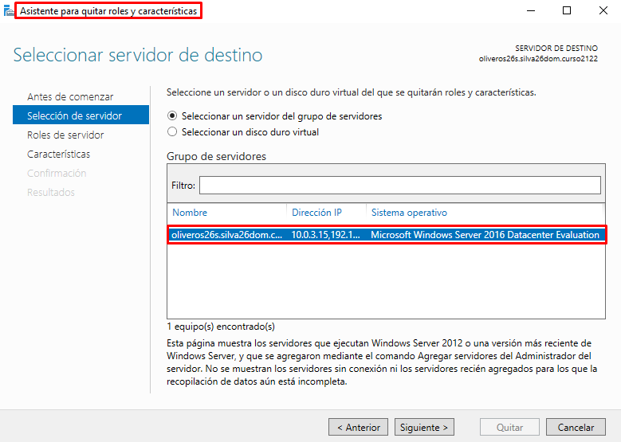
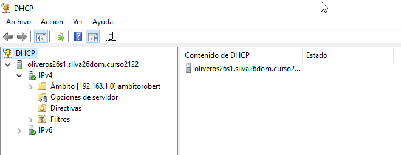

# **DHCP Failover en Windows Server 2016**

#### **PLANTEAMIENTO**

En esta tarea necesitaremos dos MV Windows Server y una MV Windows Cliente, una de las máquinas servidor trabajará como controlador de dominio para qué la segunda máquina pueda unirse y trabajar juntos en el failover.

// **RECORDATORIO** Las 3 MVs estarán en red interna y solo se comunicarán entre ellas.

### **Unión de las MV servidor en un mismo dominio**

Para esta tarea utilizaremos las MV Servidor que en anteriores tareas habíamos usado, y para agilizar el trabajo las clonaremos.

Obviamente cambiaremos su MAC y las IPs que serán:

| MV   | IP    |
| :------------- | :------------- |
| MV1 "Oliveros26s" Domain Server       | 192.168.1.10      |
| MV2  "Oliveros26s1"       | 192.168.1.11      |

Al haber hecho una clonación mientras seguía siendo controlador de dominio, tendremos que eliminar esa función de la `MV2` para que pueda unirse al dominio de la `MV1`.

Para ello nos vamos al `Asistente para quitar Roles y Características` y seguimos los pasos para inhabilitar el `servicio de dominio de Active Directory`.

Una vez terminemos de quitar los servicios de controlador de dominio, vamos a `Este equipo` > `Propiedades` > `Cambiar el dominio o nombre del equipo`.

Escribiremos el dominio que teníamos configurado en el `MV1`.

### **Creación y configuración del Failover**

Antes de crear el failover necesitamos que la MV2 tenga un servicio DHCP pero sin ningún tipo de ámbito.

>Esta parte no la he documentado porque se supone que ya sabemos hacerla por las últimas dos tareas realizadas, en mi caso la parte de Windows con un 10.

Al finalizar la instalación del servicio DHCP iremos arriba a la derecha (triangulo amarillo), y pincharemos en `Asistente posterior a la instalación de DHCP`.

Y en la casilla de `Usar credenciales alternativas` iniciaremos sesión en el controlador de dominio.

// ESTO LO HACEMOS PARA QUE EL FAILOVER RECONOZCA `MV2` EN LA `MV1`.

**En la MV1:**

Iremos a `DHCP` y click derecho en el ámbito y abriremos la opción de `Configurar conmutación por error`.
>Aclarar que no se ha creado un ámbito nuevo porque podíamos utilizar el existente.

Dejamos marcado `Seleccione todo`, porque solo tenemos un ámbito disponible.

En el siguiente apartado vemos como nos reconoce las dos MVs, en este caso dejamos seleccionada la `MV2` que será nuestra MV compañera.

En este apartado estamos configurando la relación failover, tenemos que elegir un nombre único para el mismo, tambien he decidido que la `MV1` suministre el `70%` de las IPs disponibles, y la `MV2` el `30%` restante, esto es algo muy común en ámbitos reales, ya que la `MV2` se toma como un `servidor secundario`.

>El `intervalo de cambio de estado` en la imagen esta a 60 minutos, pero más adelante se ha cambiado a 1 minuto para las comprobaciones.

Terminamos con la configuración del Failover.

### **Comprobación de duplicación de ámbito**

Al haber añadido la MV2 al Failover del ámbito de la MV1, nos debería salir duplicado el ámbito en el apartado de DHCP.

Podemos ver las propiedades de `IPv4` como tiene un apartado de `Failover`.

>Vemos que el Failover está en modo `Equilibrio de carga`, eso lo cambiaremos más adelante a `Espera activa`, esto lo que haré es que cuando apaguemos un servidor espera a que el otro cumpla la función de suministrar las IP.

### **Comprobación del Failover en la MV Cliente**

Entramos en la MV Cliente y pedimos que nos den una nueva IP para comprobar si nos la da el servicio DHCP que normalmente será suministrado de primera mano por la `MV1`.

>Nos suministra la IP el servidor DHCP de la `MV1` (192.168.1.10).

Apagamos la `MV1` y nos vamos a la `MV2` para ver una serie de cambios.

**Antes del apagado:**

El `Estado de este servidor` y `Estado del servidor asociado` están normales.

**Después del apagado**

Se ha activado el modo espera y vemos como el `Estado de este servidor` y `Estado del servidor asociado` han cambiado.

Esperaremos 1 minuto que es lo que tardara el servicio DHCP del `MV2` en tomar el mando para suministrar las IPs y volveremos a solicitar una nueva IP en el cliente.

Escribimos los siguientes dos comandos en la MV Cliente:

Por ultimo escribimos el comando `ipconfig /all` para ver todos los parámetros.

La IP que nos han suministrado es la misma que antes, esto es porque el servicio es cómodo y si ve que no hay otras máquinas que necesiten de esa IP te seguirá dando la misma. Si hubiera un mayor tráfico de direcciones solicitadas seguramente iría cambiando.

>En este caso el servidor DHCP que nos ha dado la ip es la `MV2`, ya que es el único disponible. 
