# Servidor DNS Linux bind9

**PLANTEAMIENTO:**

Realizar la instalación y configuración de un servidor DNS bind9 en una máquina de Linux y configurar tanto servidor cache como maestro definiendo las zonas directas e indirectas junto a comprobaciones en un cliente.

| MV | IP   |
| :------------- | :------------- |
| **MAESTRO/** oliveros26g2      | 172.19.26.20        |
| **CLIENTE/** oliveros26g1      | 172.19.26.21       |

### Instalación de servicio bind9

- Instalamos el `bind9` y comprobamos el estado del servicio.

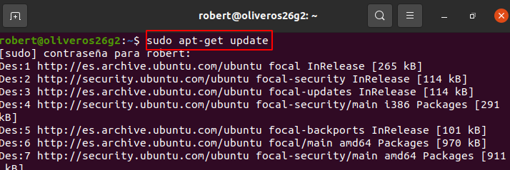

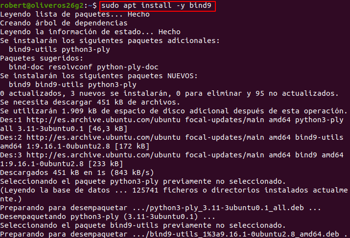

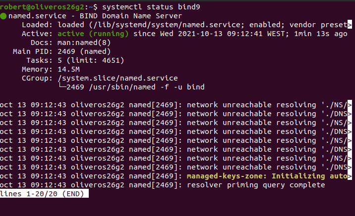

- Indicar a Linux que el servidor DNS es él mismo `(/etc/resolv.conf)`

- **ACLARACIÓN:** Aunque editáramos este archivo o incluso el archivo real, ya que este se trata de un enlace simbólico no se guardaria la configuración por algun problema que desconozco, al final tuve que cambiar un archivo que nos definía la configuración de red estáticamente en la máquina: `/etc/netplan/01-network-manager-all.yanl`.

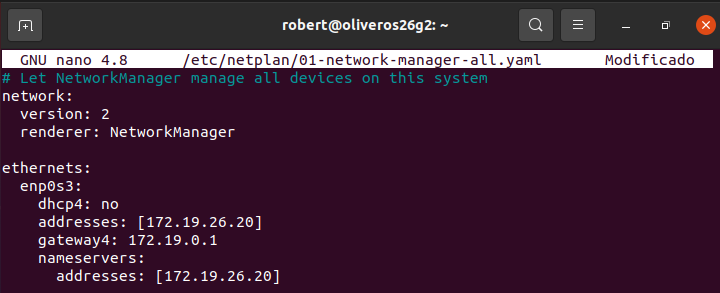

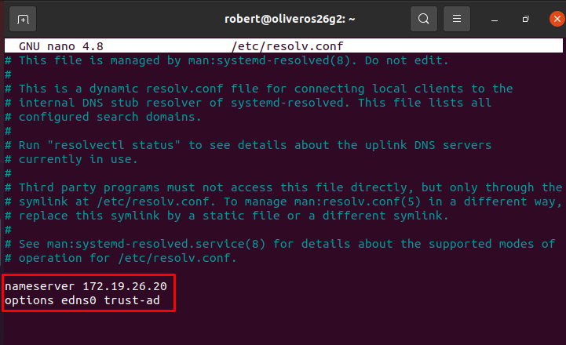

**!! Siempre reiniciaremos después de un cambio realizado!!**

>También debemos definir el DNS del cliente con la IP del maestro.

---

### Configurar servidor como caché DNS

- Tenemos que añadir `reenviadores` al archivo de configuración al que previamente hacemos una copia de seguridad.

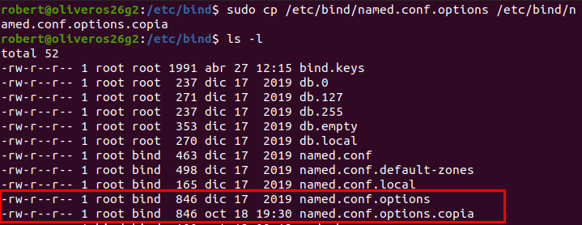

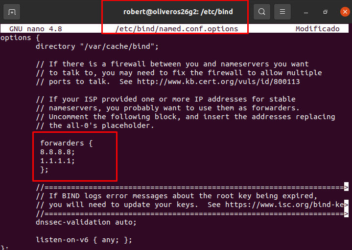

---

### Comprobaciones desde el maestro

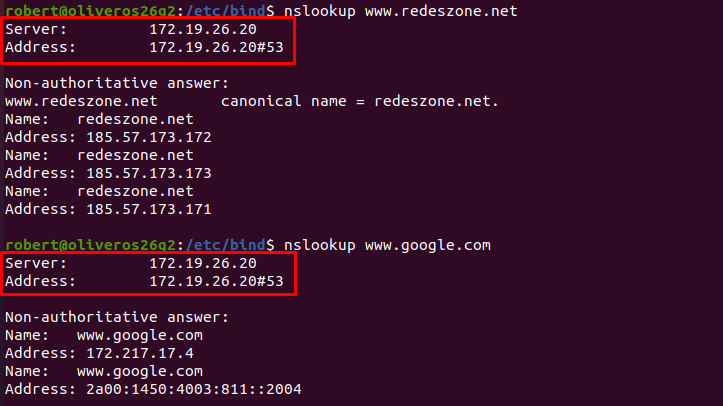

### Comprobaciones desde el cliente

---

### Configurar como DNS maestro

- Para configurar las zonas de búsqueda directa e inversa tenemos que modificar el archivo `/etc/bind/named.conf.local`.

- Copiamos el archivo por seguridad.

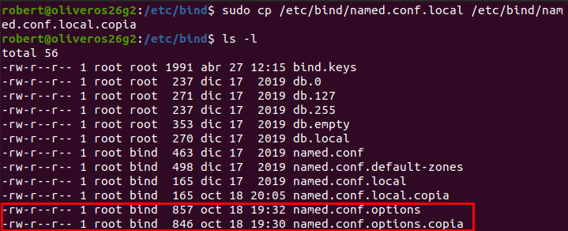

- Definimos la `ZBD (db.local)` y `ZBI (db.172.19)`.

---

### Crear un archivo de búsqueda directa y otro de búsqueda inversa

`ZBD (db.local)`

- Donde definimos nuestro propio `servidor`, un `router` y un `pc`.

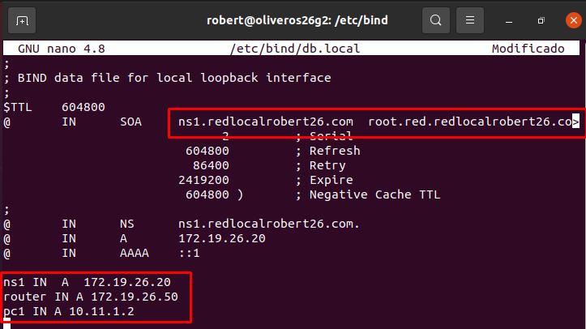

- Comprobamos que el archivo está configurado correctamente.

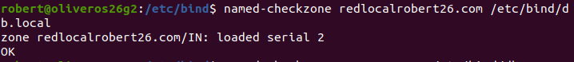

`ZBI (db.172.19)`

- Definimos nuestro propio `servidor`, un `printer` y un `router`.

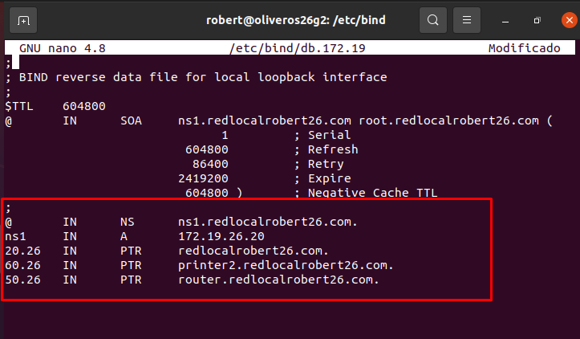

- Comprobamos que el archivo está configurado correctamente.

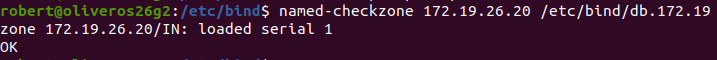

---

### Comprobar que se resuelven los nombres desde la consola del servidor

`ZBD`

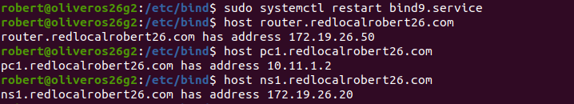

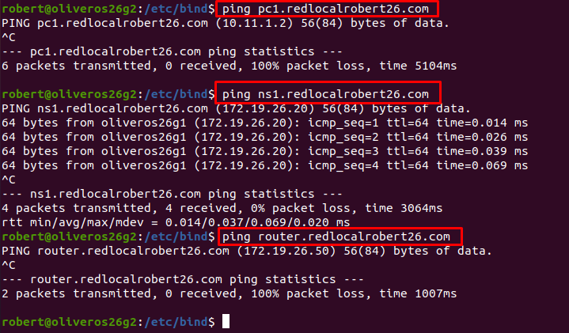

> Algunos dominios no funcionan, ya que son ficticios.

`ZBI`

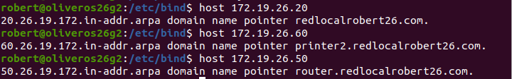

---

### Comprobar que se resuelven los nombres desde la consola del cliente.

`Ping a master y ZBD`

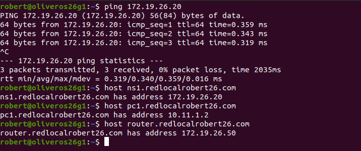

`ZBI`

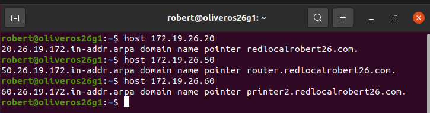
