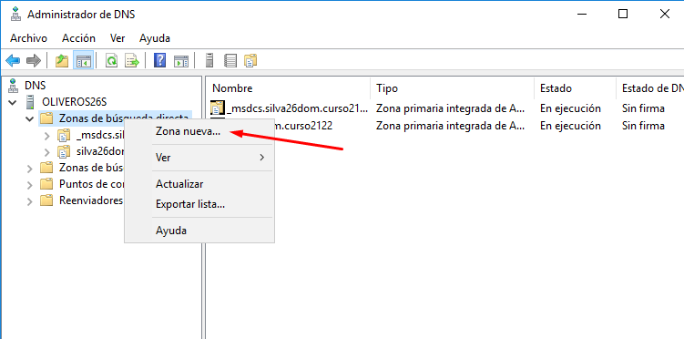
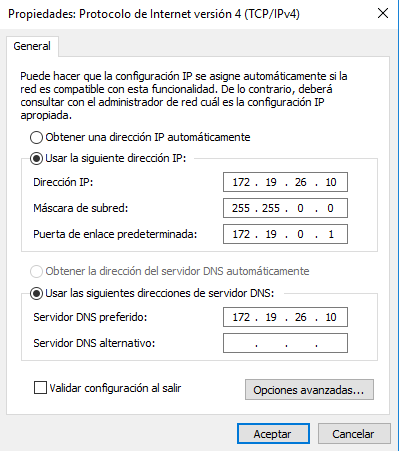

# Instalación y Configuración DNS Windows Server

### PLANTEAMIENTO

- Utilizamos la MV Windows Server 2016 y Cliente Windows que hemos usado en tareas anteriores.

- En mi caso tengo activado ya el servicio `DNS`, porque al promover el AC a controlador de dominio se nos activa el servicio `DNS`.

- Pero si no lo tuvieramos simplemente agregamos roles y lo configuramos con el asistente.

### 1. Crear una zona de busqueda directa

- Empezamos la creacion de la nueva zona con ayuda del asistente.

- Elegimos zona principal.

- Nombre elegido (`ZBD-RobertOliveros`).

- Finalizamos la zona.

### 2. Crear una zona de busqueda inversa

- Empezamos la creacion de la nueva zona con ayuda del asistente.

- En la id. de red `172.19.26`.

- Finalizamos la zona.

### 3. Configurar reenviadores de DNS

El funcionamiento de esto es el siguiente:

- Los reenviadores de `DNS publico` serviran de puerta para que el servidor pueda pedir respuestas a preguntas que no esten dentro de su red, por ejemplo, si el cliente hace alguna operacion y necesita respuesta fuera de la red que conforman `servidor-cliente` utilizara el servidor y este utilizara los reenviadores.

- Si hacemos alguna operacion `nslookup` con el cliente hacia afuera podemos comprobar los reenviadores.

  

### 4. Configurar el servidor DNS Cache

- Para ello es necesario la configuracion estatica tanto de server como de cliente, en la que el cliente tendra como DNS la ip del server.

- Servidor:

- Cliente:

- Sus configuraciones:

- Comprobacion del funcionamiento DNS Cache en servidor:

- Comprobacion del funcionamiento DNS Cache en cliente:

### 5. Configurar el servidor DNS Maestro

 En la zona de búsqueda directa añadir los siguientes registros:
- Un alias para tu servidor denominado server.

- Una impresora con IP fija denominada printer.

- Un servidor de correo (ficticio) denominado correo, asociado a una dirección en tu servidor.

Cada vez que creamos un Host(A) creamos los `registros PTR` que aparecen en la `ZBI`.

- Crear una subzona denominada servicios (dominio nuevo) y agregar a ésta un servidor `ftp` (asociado a la misma IP del servidor), una `impresora` nueva (con una IP fija) y el equipo del `administrador` del sistema (también con IP fija).

### 6. Comprobar que se resuelven los nombres desde el servidor.

- Registros ZBD.

- Registros Servicios.

- registros ZBI.

### 7. Comprobar que se resuelven los nombres desde el cliente.

Primero comprobamos que el cliente esta en el dominio y aparece en la zona de busqueda del servidor como registro A.

- Registros ZBD.

- Registros Servicios.

- registros ZBI.

