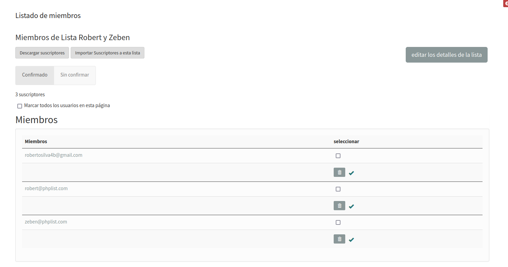
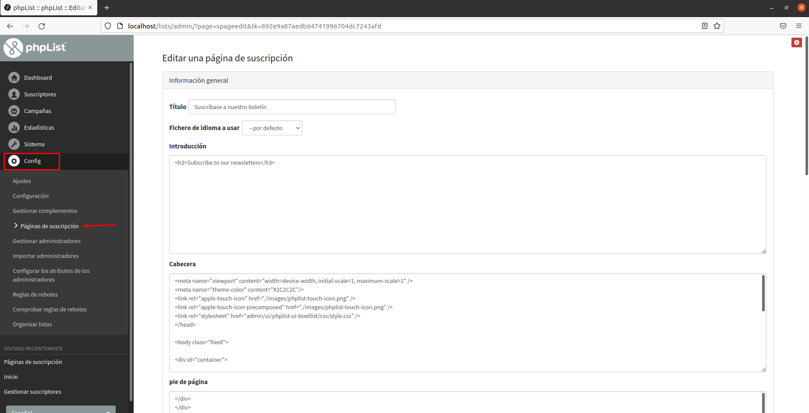
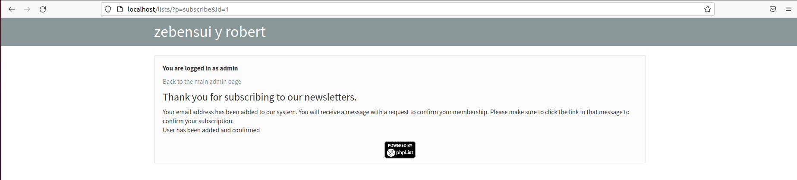

<center>

# Listas de Distribución


</center>

***Nombre:*** Robert y Zebensui

***Curso:*** 2º de Ciclo Superior de Administración de Sistemas Informáticos en Red.

### ÍNDICE

+ [Introducción](#id1)
+ [Instalación de phpList en un entorno Ubuntu con Apache, php y MySQL](#id2)
+ [Opciones de Configuración y Mantenimiento](#id3)
+ [Usos y Potenciales de phpList](#id4)
+ [Creación de Suscriptores y Listas (Usuarios)](#id6)
+ [Página de Suscripción](#id7)
+ [Campañas](#id8)


#### ***Introducción***. <a name="id1"></a>

Realizar y subir a la plataforma un informe sobre la práctica a realizar en grupo sobre la instalación, configuración, mantenimiento y prueba de un servicio de gestión de Listas de Distribución basado en el software open source `phpList`.

#### ***Instalación de phpList en un entorno Ubuntu con Apache, php y MySQL***. <a name="id2"></a>

- Primero prepararemos el entorno con el `PHP`, `Apache` y`MySQ`L, para comprobar que tenemos los servicios podemos verificar la versión de los mismos.


- Descargamos el `phpList` desde la página oficial.


> Copiamos el link .ZIP del archivo

- Lo descargamos y descomprimimos.


- Movemos todo el directorio '`lists`' a la ruta`/var/www/html`


- Accedemos a `MySQ`L y creamos una BD que llamaremos '`phplist`'


- Creamos un usuario con los permisos a la BD que llamaremos '`prueba`'


- Definimos en el archivo `config.php` los datos de usuario y BD que hemos creado con anterioridad.


- Accederemos al phpList mediante la ruta `localhost/lists/admin`


> En este caso, no hace falta que utilizamos un virtual host con Apache, ya que podemos trabajar localmente, por ello cambiamos el directorio 'lists' de lugar.


- Aquí definimos cosas tales como nuestro nombre, el nombre que usaremos como organización (que es el nombre que verán los clientes) y correo que usaremos como organización para enviar nuestras campañas.  


- Iniciamos con el usuario `admin`


- Podemos comprobar las tablas generadas en la BD.


#### ***Opciones de Configuración y Mantenimiento***. <a name="id3"></a>

Dentro de phpList hay muchísimas opciones de configuración y mantenimiento del sistema, después de trabajar con él, vamos a mostrar cuáles son para nosotros las más importante y vitales para un funcionamiento correcto del mismo.

**System**

- Tener el servicio adaptado a nuestro idioma, esto lo podemos modificar en el archivo `config.php` escribiendo esta línea:

```
$default_system_language="es";
```


- La creación de tablas de la base de datos, aquí podemos comprobar de manera constante que todas las tablas funcionan bien.
Y se actualiza a tiempo real.


- El registro de eventos, donde se registran todos los movimientos que se hace al servicio.


- Las siguientes opciones son las de: agregar las tablas de BD, actualizar del phpList, gestionar rebotes y el de enviar la cola, es decir, activar las campañas que tenemos en cola.


- Este apartado es muy importante si recibimos un error en nuestra BD, ya que nos da una, guia sobre como reparar cada tabla.


**Config**

- El primer apartado de configuración, es una gran lista donde podemos cambiar "en caliente" cualquier nombre, dirección, ruta o opcion del servicio.


> Nosotros por ejemplo, cambiamos el nombre de la organización.

- En esta opción podemos agregar, eliminar, activar o desactivar plugins para el sistema, muchos de ellos son necesarios a nivel de empresa, sobre todo para un correcto trabajo con aplicaciones de terceros.


- Estos tres apartados tiene que ver con los administradores, simplemente sirven para agregar/importar administradores y gestionar sus atributos.


#### ***Usos y Potenciales de phpList***. <a name="id4"></a>

Para entender los usos y potenciales de phpList tenemos que saber que es este servicio.

phpList es uno de los administradores de listas de correo de código abierto más populares que tiene la capacidad de enviar boletines, noticias y mensajes a una gran cantidad de suscriptores es decir, usuarios.

Muchas de las funciones que tiene son:
- API.
- Acciones activadas por evento.
- Análisis de campañas.
- Autorrespondedores.
- Biblioteca de imágenes.
- Bloqueo de spam.
- Campañas de goteo.
- Captura de clientes potenciales.

Estamos ante un servicio que se puede adaptar a cualquier necesidad del administrador, puede ser utilizada como aplicación de marketing, newsletter de cualquier tipo de página online, distribución de correos en empresas o nichos que interesen al administrador.

Dentro de una empresa puede servir para gestionar correos segmentados por departamentos, auto-replay a consumidores, correos periódicos que se envían a los clientes para que se mantengan en contacto...múltiples opciones de marketing por la capacidad que tiene de envíos masivos.


#### ***Creación de Suscriptores y Listas (Usuarios)***. <a name="id6"></a>

- Las funcionalidades que podemos configurar a cerca de los Suscriptores y Listas de Suscripción son las siguientes:


- Primero que todo, vamos a crear una lista de suscripción donde se almacenaran los suscriptores, aunque por defecto el phpList viene con dos listas creadas (una pública y otra privada)


- Para añadir suscriptores tenemos que importarlos (`Opción: Importar correos electrónicos`):


> Marcamos que esta importación se hará en la nueva lista creada.


- Vamos a Buscar suscriptores y veremos los clientes importados junto al usuario Admin.


- Otra funcionalidad que tenemos es la de Limpieza de suscriptores, donde podemos administrar de una manera general todos los suscriptores.


- Para cancelar un suscriptor de una lista de suscripción vamos a Lista de cancelaciones.


> Como ejemplo, el correo zebensui66@gmail.com

- Vemos que desaparece.



- También podemos agregar atributos de suscriptores que tendrán que rellenar, por si queremos clasificarlos o conocer algo más sobre ellos, por norma general las empresas suelen pedir tanto correo como nombre, en este caso el nombre sería un atributo.


> Creamos los atributos de `Nombre` y `Edad`

#### ***Página de Suscripción***. <a name="id7"></a>

Crearemos una página de suscripción a nuestro newsletter, aunque solo podremos ver la vista de un administrador y no de un usuario real que entra a la página, ya que estamos trabajando en modo local.

Para crear la página nos iremos a `Config` > `Páginas de suscripción`


>Podremos editar tanto introducción, Cabecera, Pie de página...

- Seleccionamos la lista creada anteriormente para que sea en esta donde se almacenen los suscriptores que accedan desde la página.


- Seleccionamos los atributos que creamos con anterioridad en el apartado de suscriptores para probarlos.


- Una vez creamos la pagina de inscripción podemos observar como queda el resultado.


> Como se puede observar el nombre de la organización lo hemos cambiado de "zebensui" a "zebensui y robert"

- Probamos a ingresar un cliente nuevo que ira directamente a la lista que creamos.





#### ***Campañas***. <a name="id8"></a>

Una vez tengamos todo esto configurado, estaremos listo para crear una nueva campaña.


- Iniciamos una nueva campaña


- En el primer apartado tenemos que configurar el mensaje que queremos enviar, a nosotros se nos olvidó sacar foto, pero daba a elegir entre un mensaje creado por nosotros en código html o pegar el link de una página.

- En el segundo paso elegimos el formato.


- Luego vamos a configurar a que hora se enviara la campaña y cuando detenerlo, también hasta que fecha queremos mantenerlo en cola.


> Como vemos, solo podemos definir los minutos cada 15.

- Seleccionamos a que lista de suscriptores vamos a enviar la campaña.


- Antes de finalizar nos deja marcar ciertas opciones que tienen que ver con los análisis y métricas de la campaña, que funcionan con aplicaciones de terceros como Google Analytics.


- En el listado de campañas vemos nuestra campaña y alguna de las métricas.


- También podemos crear o importar plantillas para las campañas, en internet hay muchísimas para escoger.


