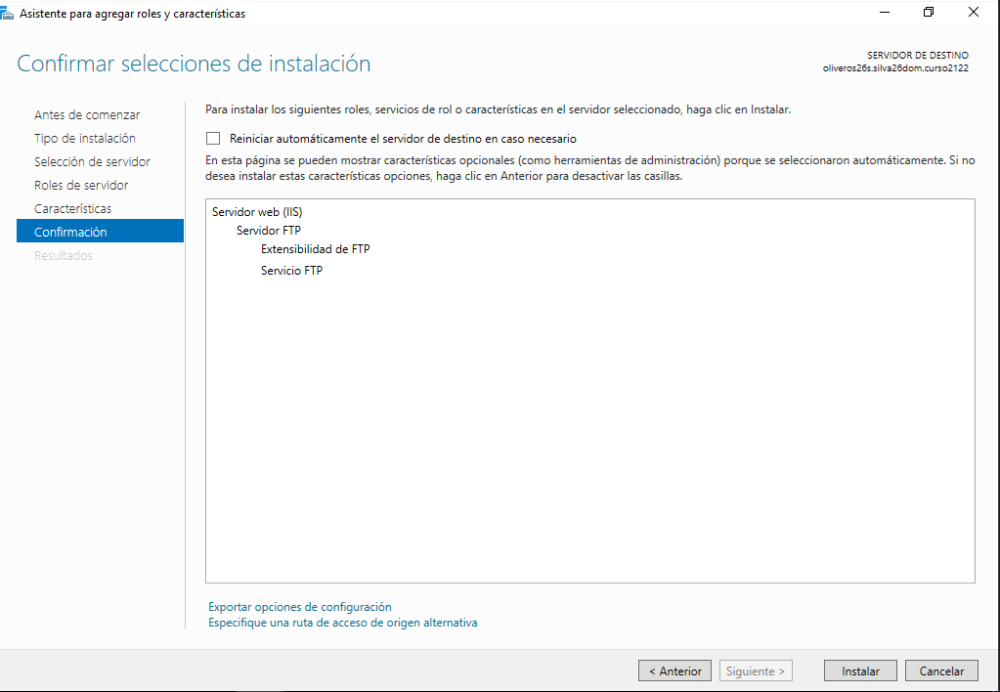
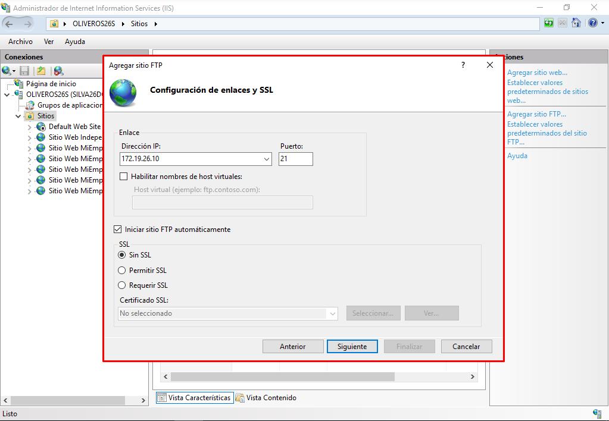
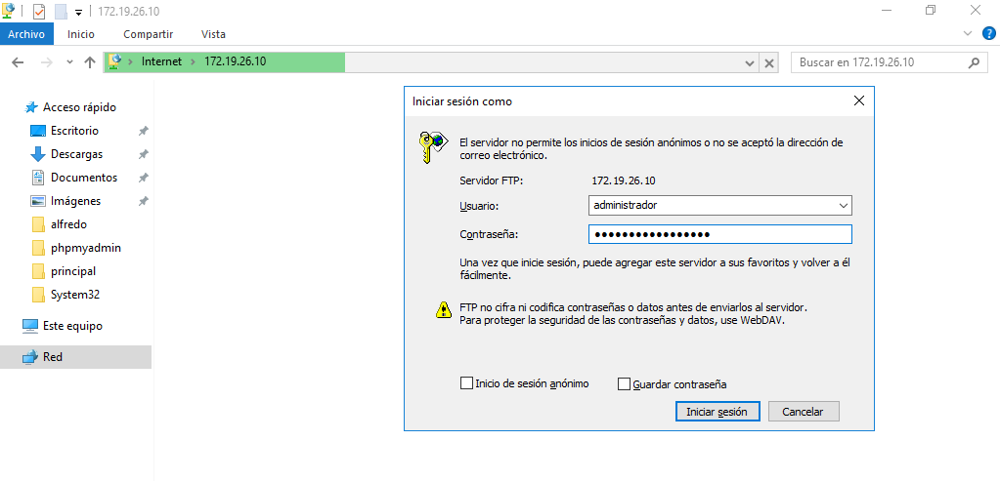
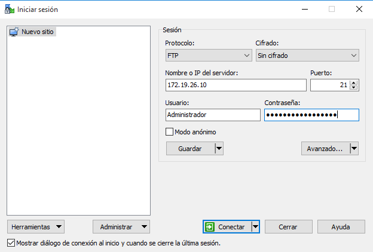
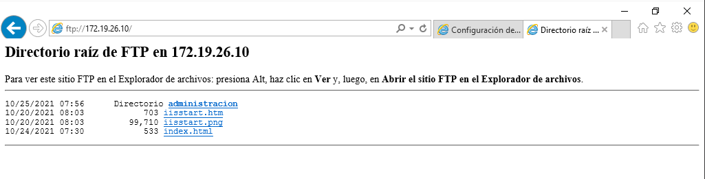

# Informe FTP - Prácticas Windows y Linux

Crear un manual de instalación y configuración de un servidor FTP en una máquina con Windows Server y otra Linux.

## Instalación y Configuración del Servicio FTP en Windows 2016 Server

- Necesitaremos dos MVs:

| MV  | Hostname  | IP  |
|---|---|---|
| MV1 Server | server26s  | 172.19.26.10 |
| MV2 Cliente | cliente26  | 172.19.26.11 |

#### Instalar Servicio FTP en Windows 2016 Server, a través de Agregar roles y características (IIS)

- Agregamos Roles y Características.

- Servidor web (IIS) --> Servidor FTP

#### Acceder a la creación y configuración de Sitios FTP por medio de la Administración de IIS.

- Esta es la configuración y creación de sitios FTP.

#### Crear tres nuevos sitios FTP

**Primer sitio FTP - Asociado a la unidad C:**
 - No debe permitir accesos anónimos,
 - Sin uso de SSL
 - Solo el usuario Administrador podrá acceder al sitio.
 - Modos lectura y escritura.

Examina todas las opciones de configuración de la página principal de tu Sitio FTP (IIS) y haz una descripción breve de cada una en el informe.

- Las opciones son muy parecidas a los Virtual Hosts, tenemos registros de las sesiones FTP, cuantas hay conectadas en el momento, podemos configurar el certificado si lo hubiese, editar como se deben autentificar los usuarios al servicio ftp, etc..

Trata de acceder al sitio ftp desde el propio servidor a través de un navegador y un explorador de archivos.

- Accedemos con el usuario Administrador que es el único que tiene permisos.

*Navegador*

*Explorador de Archivos*

Si intentamos acceder desde otros usuarios no nos dejara. El usuario "Administrador" tiene permisos de lectura y escritura.

Comprobamos descargar archivos desde Server y Cliente.

Accede ahora desde un cliente Windows de la misma forma.

*Navegador*

*Explorador de Archivos*

Instala el software WinSCP en el cliente Windows, configura la conexión a tu sitio ftp y trata de establecer conexión y realizar comprobaciones.

- Elegimos la instalación típica.

- Configuramos la conexión al sitio ftp del servidor.

- Lo que vemos a la derecha es el contenido del Disco Local C:

- Probamos a descargar un archivo.

**Segundo Sitio FTP - Inetpub**
 - Se permitirá el acceso a todos los usuarios de Active Directory.
 - Modo Lectura y Escritura.
 - No permitimos acceso anónimo.
 - Habilitamos en este caso la posibilidad (permitir, no requerir) de conexiones SSL.

Estos son los usuarios de Active Directory

*Navegador*

- Probamos el funcionamiento con el usuario "Administrador" (server)

- Probamos con el usuario "alfredo" (server)

*Explorador de Archivos*

- Probamos con el usuario "julia" (server)

**Cliente**

- Probamos el funcionamiento con el usuario "alfredo" desde el cliente.

**Conexion desde el cliente usando WinSCP**

- Usando el cifrado SSL y el usuario "robert"

- A la derecha se encuentra el contenido de inetpub/wwwroot

- Descargamos un archivo.

**Tercer Sitio FTP - Archivos y Carpetas**

 - Crear un directorio que contengan carpetas y archivos.
 - Permitiremos acceso anónimo.
 - Modo consulta y lectura.
 - Registro DNS (ftp.miserver.com)

Creamos la carpeta Prueba 3er FTP

>Contenido de la carpeta

Creamos el sitio FTP.

Probamos el acceso desde el servidor

Nos metemos dentro de algún archivo

Probamos la conexión desde el cliente usando WinSCP.

Comprobamos el acceso desde el navegador del cliente.

- Se debe crear un nuevo registro DNS que permita acceder a nuestro sitio FTP a través de la dirección ftp.miserver.com

- La manera para que podamos ofrecer varios sitios FTP simultáneos es cambiando los puertos de los mismos, porque no pueden ser iguales.

 - Sitio FTP Inetpub - Puerto 22
 - Sitio FTP Unidad C - Puerto 23
 - Sitio FTP Archivos y Carpetas - Puerto 21

Hacemos inicio de sesión en los tres sitios FTP desde el WinSCP del cliente.

## Instalación y Configuración del Servicio FTP en Linux

| MV  | Hostname  | IP  |
|---|---|---|
| MV1 Server | oliveros26g1  | 172.19.26.21 |
| MV2 Cliente | oliveros26g2  | 172.19.26.20  |

#### Instalar Servicio SSH en el servidor Linux.

#### Crear dos usuarios en el sistema, con diferentes privilegios y niveles de acceso al filesystem.

- He creado el usuario1 y usuario2.

- El usuario1 tambien pertenece al grupo "root" mientras que el usuario2 no pertenece, así tendrán permisos diferentes.

#### Comprobar, desde una máquina cliente, acceso de los usuarios mediante ssh.

- Usuario1

- Usuario2

#### Tratar de ejecutar una aplicación gráfica del servidor de forma remota, desde el cliente, mediante ssh.

- Usuario1

- Usuario2

#### Acceder, también desde el cliente, mediante sftp (ftp seguro, incluido en el paquete ssh) al sistema de ficheros del servidor y probar acceso, carga y descarga de archivos con ambos usuarios.

- Creamos dos archivos desde el cliente para enviarlo al servidor, uno para cada usuario.

- Creamos en el servidor un archivo para enviarlo al cliente (usuario1)

- Enviamos y Recibimos archivos mientras estamos conectados via sftp con el usuario1.

>Amarillo: archivo que enviamos / Verde: archivo que recibimos

Desde el usuario2

>Amarillo: archivo que enviamos / Verde: archivo que recibimos

#### Realizar varias copias de archivos hacia / desde el servidor mediante scp, utilizando también los dos usuarios creados anteriormente

*usuario1:*

- Enviamos un archivo desde el cliente al /home del usuario.

> En este caso me equivoqué de archivo porque le puse el nombre de usuario2, pero los demás están bien.

- Descargamos un archivo del servidor al cliente.

*usuario2:*

- Enviamos un archivo desde el cliente al /home del usuario.

- Descargamos un archivo del servidor al cliente.

#### Instalar el paquete proftpd

#### Investigar y editar el fichero de configuración /etc/proftpd/proftpd.conf buscando información en Internet

- Tenemos que descomentar el parámetro "DefaultRoot" , esto significa que el usuario esta limitado a su carpeta personal /home. También podríamos definir muchas cosas como una carpeta "DefaultRoot /carpeta" para usar el ftp de manera más organizada. Pero en mi caso no.

- Siempre que hagamos un cambio hay que reiniciar el servicio.

#### Tratar de conectar al servicio ftp gestionado por proftpd tanto desde el servidor como desde un cliente.

*Servidor*

*Cliente*

#### Desde la máquina cliente, probar el acceso al ftp mediante los usuarios creados y realizando diferentes operaciones de listado, subida y descarga de archivos.

*usuario1:*

- Creamos un archivo en el servidor para la descarga y otro en el cliente para la subida.

- Hacemos la subida de un archivo, además listamos los archivos del directorio /home/usuario1.

- Descargamos un archivo del servidor.

*usuario2:*

- Creamos un archivo en el servidor para la descarga y otro en el cliente para la subida.

- Hacemos la subida de un archivo.

- Descargamos un archivo del servidor, además listamos los archivos del directorio /home/usuario2.

