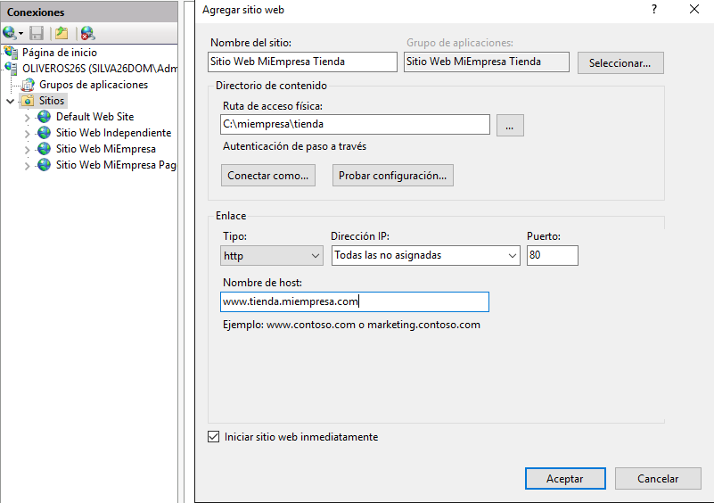
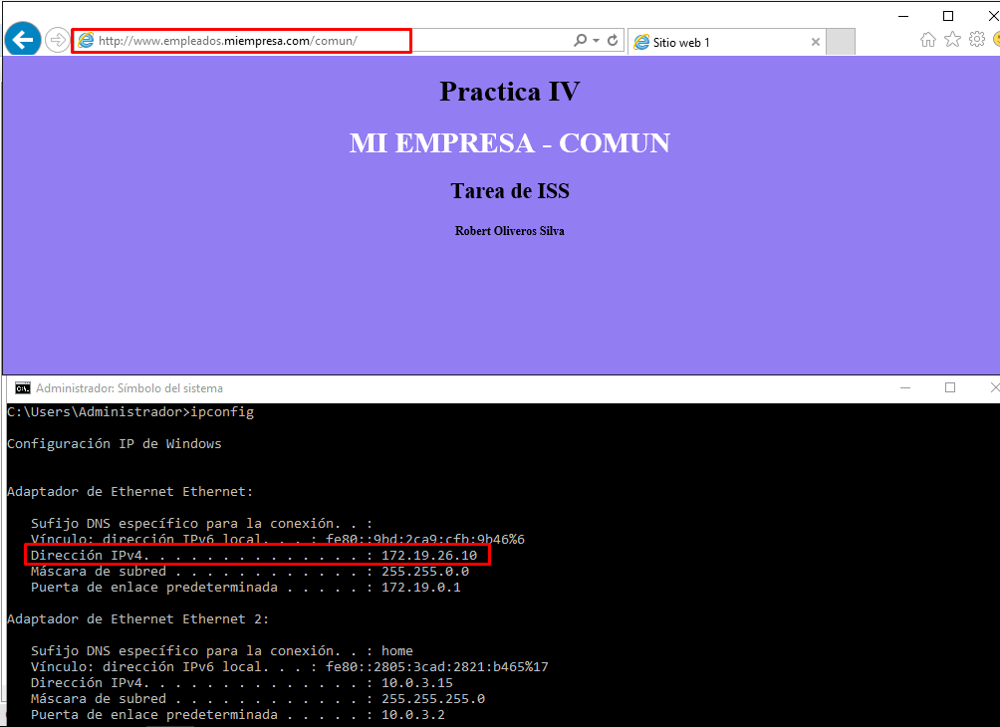
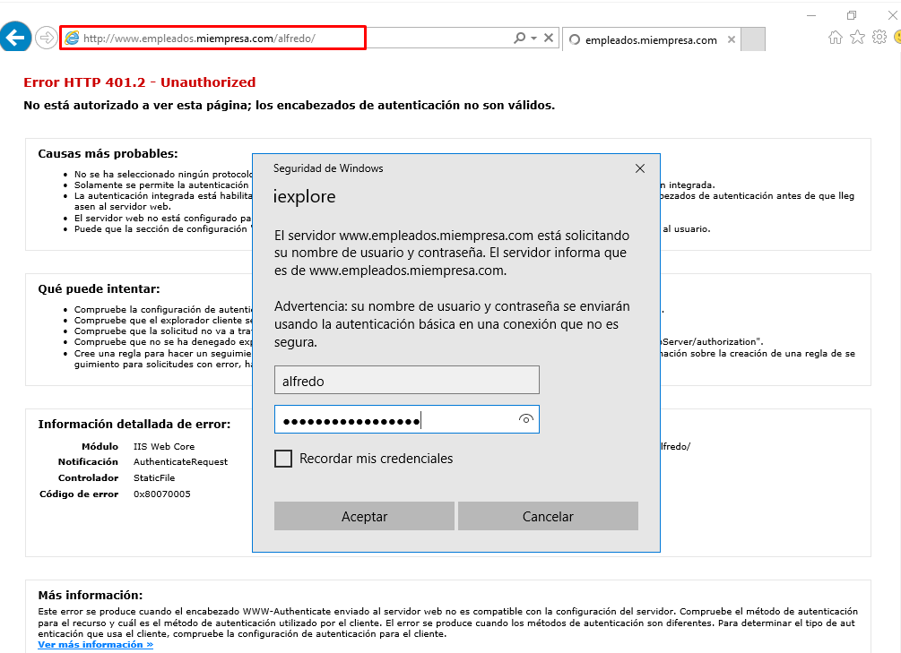

# Informe IIS - Servidor Web avanzado - Carpetas seguras y privadas

## Práctica de IIS Windows 2016 IV

#### Crea una nueva zona de búsqueda directa en los servicios DNS asociado al dominio miEmpresa. Crea también una carpeta miEmpresa en C:\ y una subcarpeta ‘principal’.

#### Crea un nuevo sitio web denominado miEmpresa en IIS asociado a la subcarpeta anterior y con acceso a través de la dirección www.miEmpresa.com. Actualiza DNS adecuadamente.

- Comprobamos el funcionamiento desde el servidor.

- Desde el cliente.

####  Crea un nuevo sitio web denominado ‘pagos’ (pagos.miEmpresa.com) y configura este último para ser accedido de forma segura, vía ‘https’.

##### Configuración A:

- Para ello creamos la carpeta `miempresa/pagos` y configuramos para que el sitio este asociado a esta.

- El sitio web de "`Pagos`" lo certificaremos con un `Certificado Autofirmado`.

- Configuramos adecuadamente el `DNS`.

- Comprobamos el acceso via "`http`" desde el `servidor`.

- Comprobamos desde el `cliente`.

Vemos como en ambos, la página se autodirige a la página principal del IIS.

- Comprobamos el acceso "`https`" desde el `servidor`.

- Comprobamos desde el `cliente`.

##### Configuración B:

#### Crearemos un nuevo sitio seguro (tienda.miempresa.com) con la generación de un Certificado Digital a través de la aplicación OpenSSL

- Descargamos `OpenSSL`.

- Solicitamos el certificado.

- Importante acordarse de la longitud en bits que definimos.

- Guardamos el archivo generado en la ruta `C:/OpenSSL/bin`.

- Siguiendo los pasos que se nos detallan, generamos un archivo para certificar nuestra web.

- Generamos un archivo `.crt` que definimos para completar la solicitud.

- Lo agregamos al sitio.

- Comprobamos en el `servidor`.

- Si intentamos acceder desde "`HTTP`" nos redirige a la página principal.

- Desde el `cliente`.

- Comprobamos desde el cliente que nos redirige a la página principal si accedemos vía "`HTTP`"

## Práctica de IIS Windows 2016 IV B

#### Necesitamos crear una carpeta empleados (dentro de miEmpresa) y, dentro de esta, tres o cuatro subcarpetas personales con nombres de empleados y una, denominada común, a la que tendrán acceso todos los empleados, pero no otros usuarios sin identificar.

#### o Crearemos el nuevo sitio web, como subdominio de nuestro dominio principal, asociado a la carpeta genérica empleados.

- Definimos el `DNS`.

#### Colocar un fichero index.html diferente en cada una de las carpetas creadas, con el objetivo de poder comprobar el acceso desde un navegador

#### Para el sitio web creado y para cada una de sus carpetas, deshabilitamos el acceso anónimo

#### Agregar función de Autenticación Básica a nuestro Servicio de IIS a través de la Administración del Servidor

#### En Active Directory, crearemos un usuario para cada empleado (tantos como carpetas personales) y un grupo Empleados que los incluya a todos

#### Desactivamos, para la carpeta empleados, los permisos heredables a través de las opciones avanzadas en la ficha de seguridad. Añadimos grupo de Administradores con Control Total y grupo Empleados con Lectura y Ejecución+ Mostrar Carpeta+Leer.

#### Realizamos el mismo procedimiento para cada una de las carpetas personales de los empleados, colocando como usuarios autorizados el Grupo de Administradores (Control Total) y el empleado propietario de cada carpeta (con los permisos que creas convenientes).

#### Realizamos el mismo procedimiento para la carpeta ‘común’, colocando como usuarios autorizados el Grupo de Administradores (Control Total) y el grupo Empleados (con los permisos que creas convenientes).

#### Comprobamos el acceso, tanto desde el servidor como desde el cliente W7, a las diferentes carpetas con distintos usuarios.

- Comprobaciones desde el `servidor`:

- Intentamos entrar en la página de `Isabel` desde el usuario `Alfredo`.

- Entramos a la página común desde algún usuario.

- Comprobaciones desde el `Cliente`:

