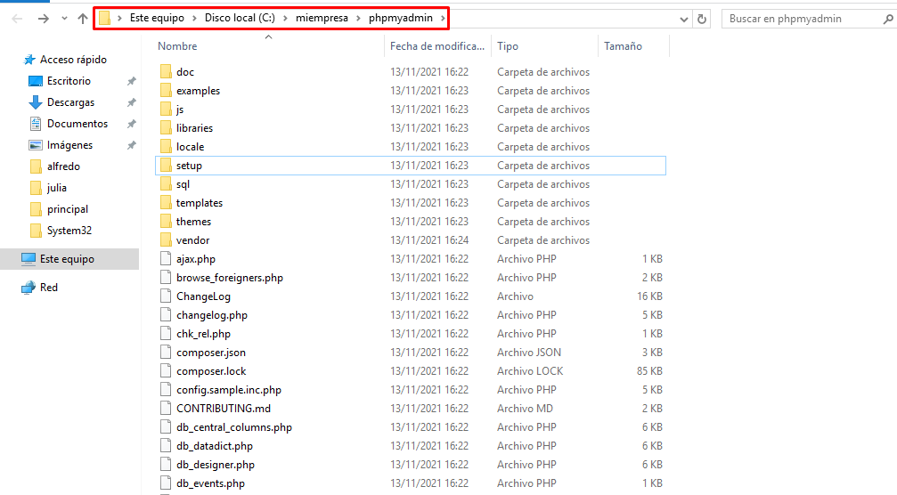

# Informe IIS - Servidor Web avanzado - PHP, MySQL, phpMyAdmin, FTP y Drupal

Vamos a realizar las instalaciones y configuraciones necesarias para obtener un Servidor Web con soporte PHP y accesos a bases de datos relacionales, acceso FTP y gestor de bases de datos. Sobre este servidor, podremos realizar instalaciones de aplicaciones integradas  desde el propio servidor o en modo remoto desde un cliente W7.

## Práctica de IIS Windows 2016 Server V

#### PHP

- Instalamos PHP para nuestro sitio web gestionado por IIS.

- Elegimos opcion IIS FastCGI.

- En mi caso necesitaba agregarlo al IIS.

> Ya estaria instalado el PHP.

- Configurar luego IIS para que
admita el fichero index.php por defecto en las carpetas y/o sitios que nos interese.

- Comprobamos la instalacion correcta de PHP colocando un fichero index.php en el sitio web (www.miempresa.com) con el siguiente codigo: <?php phpinfo(); ?>

#### MySQL

- Instalamos MySQL y .NET Framework 4.0

>En mi caso el .NET Framework 4.0 ya lo tenia instalado.

#### PHPMYADMIN

- Instalamos PHPmyAdmin para un nuevo sitio web asociado llamado phpmyadmin.miempresa.com, creado la correspondiente carpeta donde descomprimiremos los archivos y actualizar DNS.

- Descomprimiremos en la ruta miempresa > phpmyadmin.

DNS

## Práctica de IIS Windows 2016 Server VI

#### FileZilla

- Instalamos el servidor FTP Filezilla en la MV servidor

> Definimos una password para el administrador.

- Crear un usuario denominado ftpuser en el Servidor FTP.

- Crear un nuevo registro DNS que permita acceder a nuestro sitio FTP a través de la dirección ftp.miEmpresa.com.

**Desde el cliente:**

- Comprobar acceso a phpMyAdmin desde un navegador (phpmyadmin.miEmpresa.com)

- Descargar CMS Drupal de drupal.org.

- Instalar un cliente FTP FileZilla.

- Comprobar el acceso al sitio FTP creado a través de un navegador y con el usuario ftpuser.

> Nos conectamos al FileZilla Server.

- Y creamos un sitio remoto que una la carpeta principal del servidor con nuestra maquina cliente. Asi podremos pasarle los archivos que queramos.

Comprobamos el funcionamiento de FileZilla desde un navegador.

- La ruta quedaria asi:

**Comprobacion desde el Servidor:**

**Comprobacion desde el Cliente:**

- Descomprimir y subir archivos Drupal a carpeta principal (www.miEmpresa.com).

> Una vez pasados los archivos podemos ir a www.miempresa.com y veremos la instalacion del Drupal.

- Crear una nueva base de datos, denominada cms, a través de phpMyAdmin y crear usuario cms y asignar todos los privilegios para la base de datos anterior.

- Instalar CMS Drupal desde el navegador siguiendo los pasos y consultando documentación
en Internet.

