# Informe IIS - Servidor Web básico

#### PLANTEAMIENTO

Intalaremos el servicio IIS y configuraremos diversos sitios webs planteados en los diferentes PDFs.

| MV  | Rol  | IP  |
|---|---|---|
| MV1 (oliveros26s)  |Server   |172.19.26.10   |
| MV2 (oliveros26s1)  |  Cliente | 172.19.26.11  |

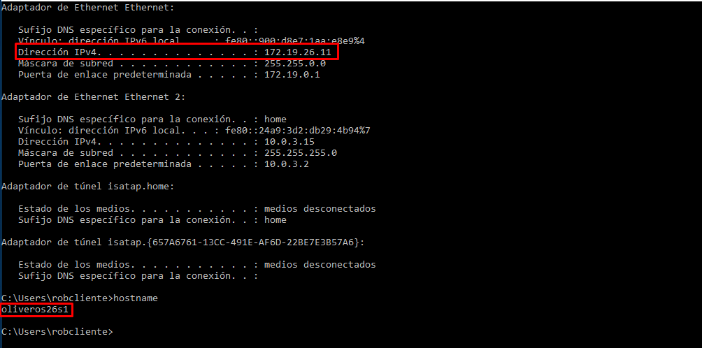

## Práctica de IIS Windows 2016 Server I

- Instalar IIS en Windows.

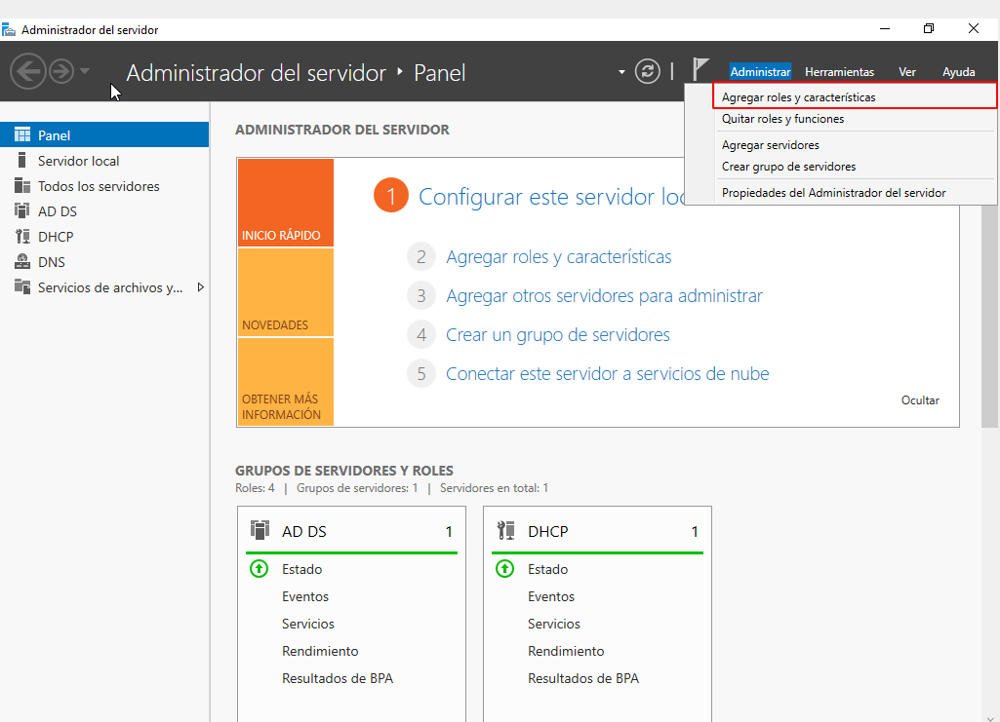

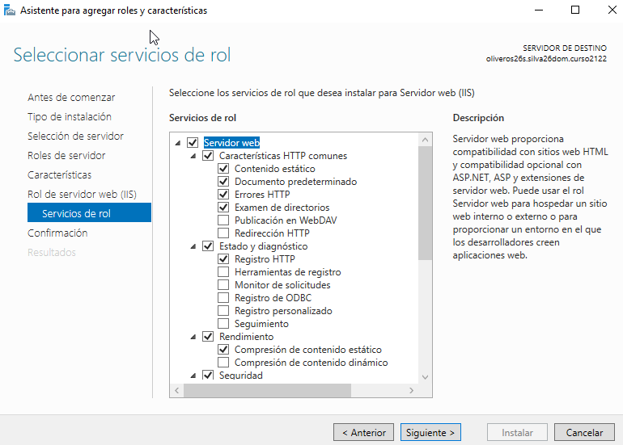

##### Comprobar acceso a nuestro servidor web (localhost)

#### Entrar en cliente Windows y acceder, desde un navegador web a traves de la IP del servidor

#### Acceder ahora desde MV2 a la misma página mediante el nombre principal del dominio y desde cualquier otro alias que haya sido definido en la configuración DNS.

- Tenemos que definir que nuestro sitio web tenga como enlance el nombre principal del dominio.

`En el servidor:`

`En el cliente:`

#### Añade un alias en el servicio DNS que relacione el sitio www con el dominio principal

- Creamos la relacion www en el servicio DNS.

En el servidor:

En el cliente:

#### Crea una página web HTML sencilla (index.html) como página principal de tu dominio y colócala en `C:\Inetpub\wwwroot`.

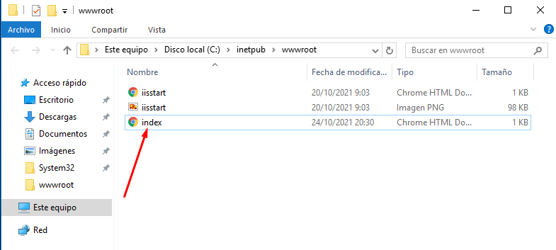

- Comprobaremos la nueva pagina HTML.

En el servidor:

En el cliente:

#### Crea un pequeño sitio web con varias páginas e imágenes organizadas en subcarpetas de wwwroot.

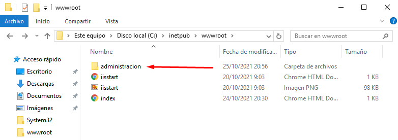

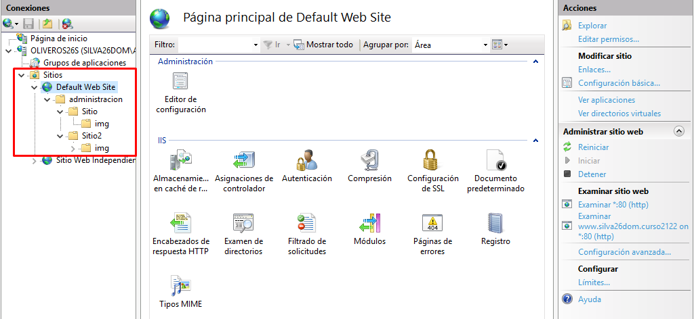

En el servidor:

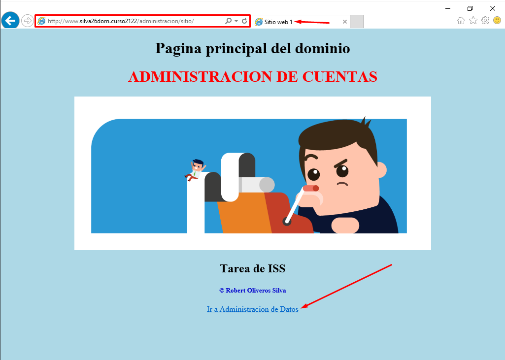

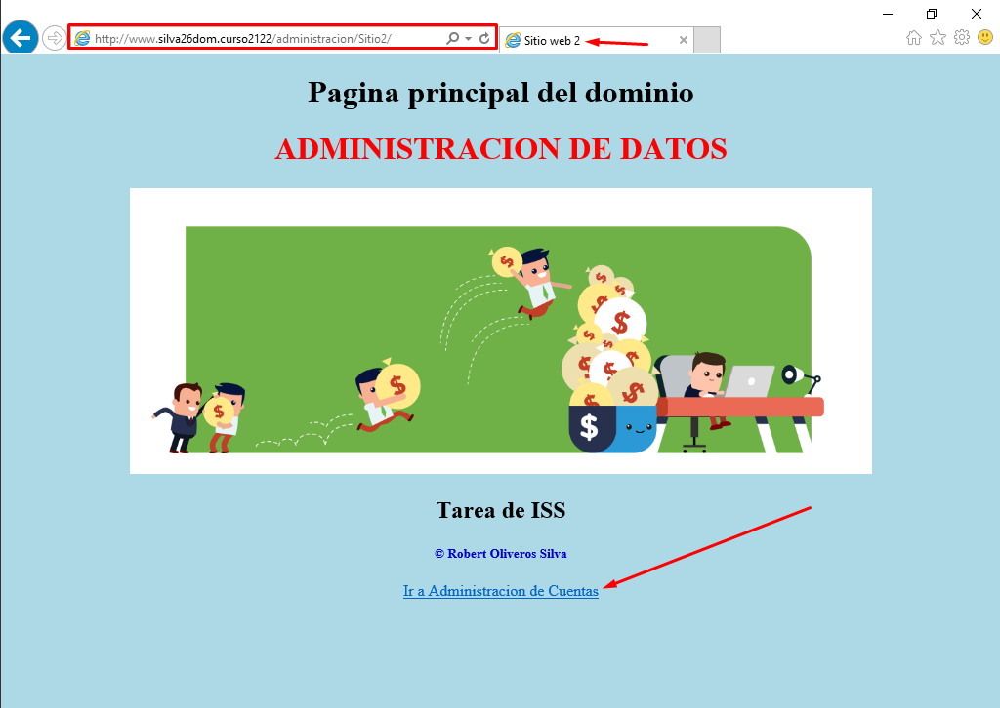

En el cliente:

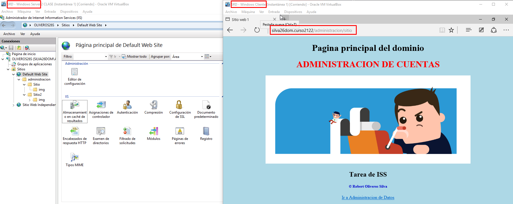

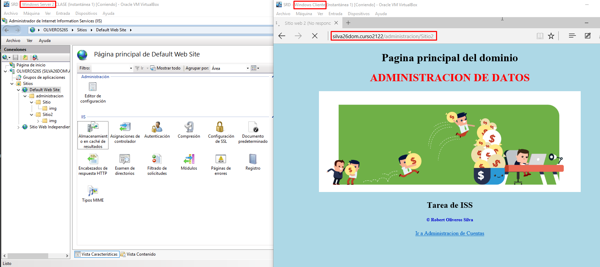

## Práctica de IIS Windows 2016 Server II

#### Creación de sitios web independiente

- Agregamos un nuevo Sitio Web.

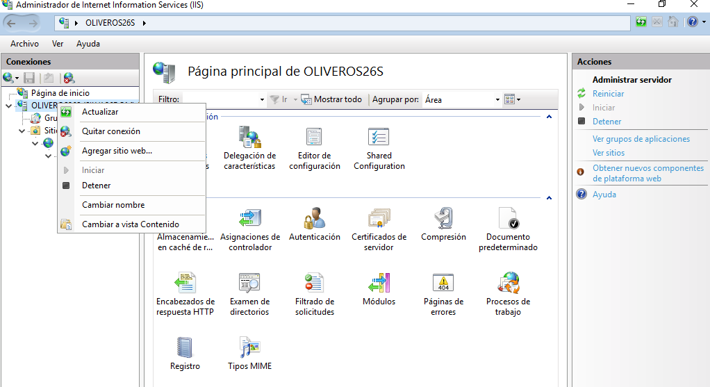

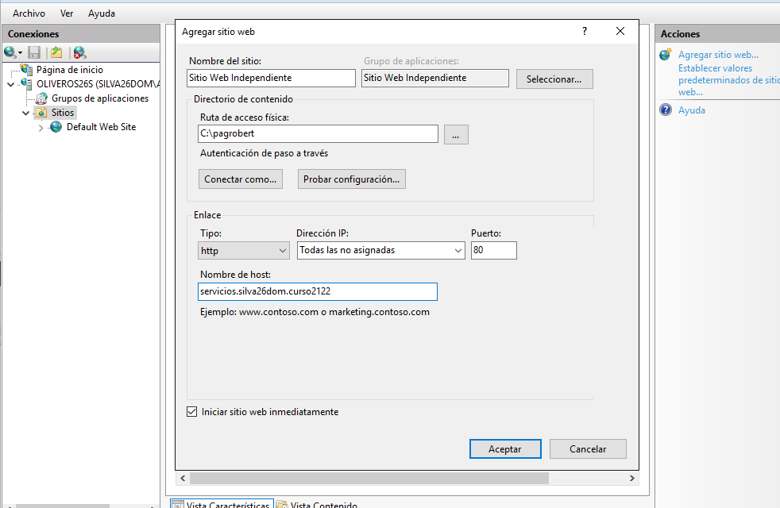

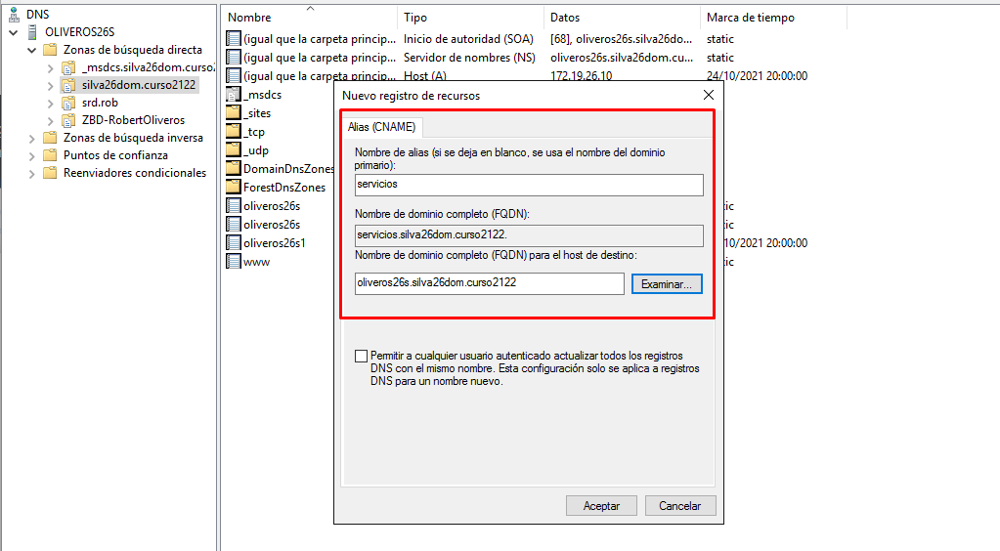

- Cambiamos los permisos.

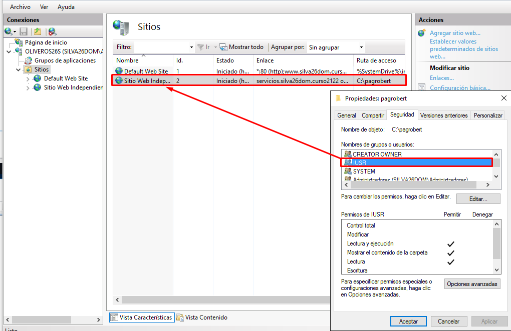

- Creamos una carpeta donde estara nuestro index junto a otras carpetas e imagenes.

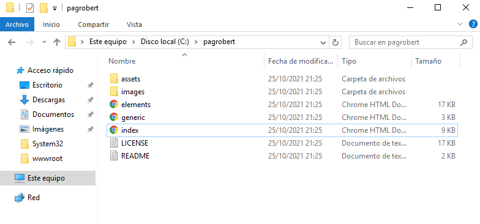

- Probamos el sitio web en el servidor:

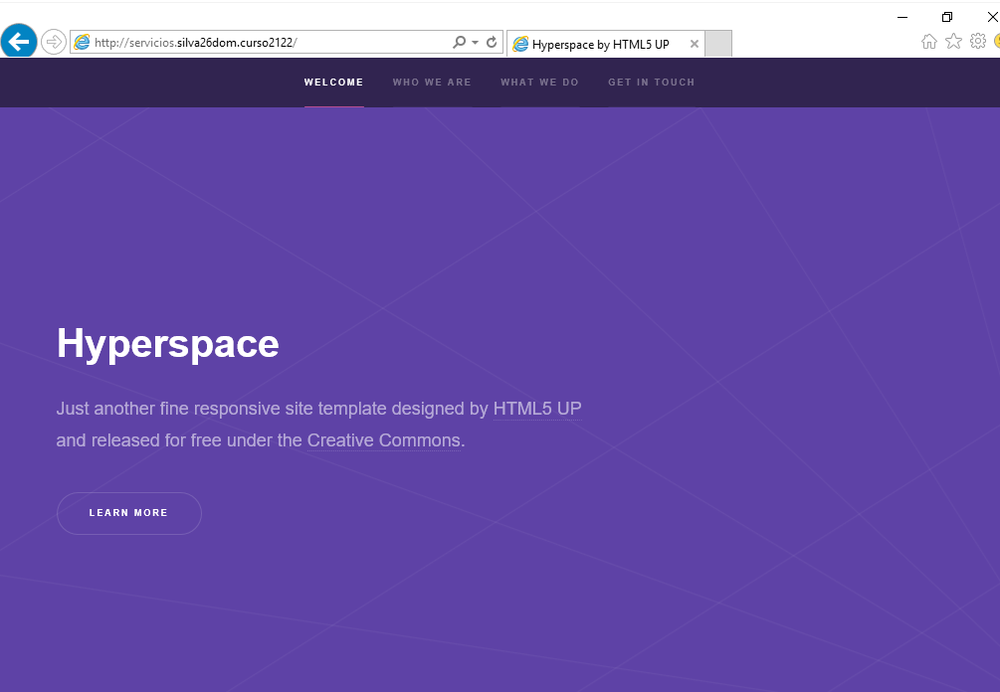

- En el cliente:

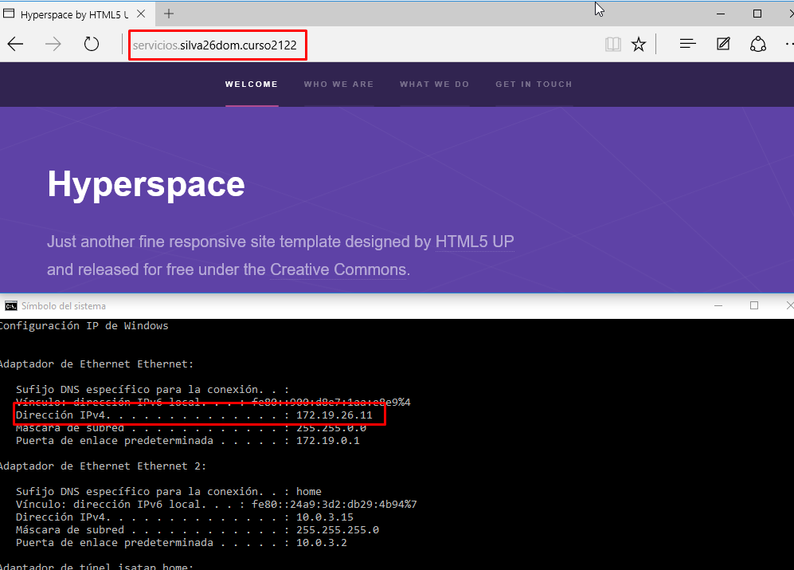

## Práctica de IIS Windows 2016 Server III
