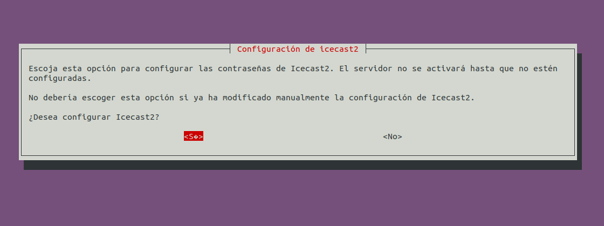
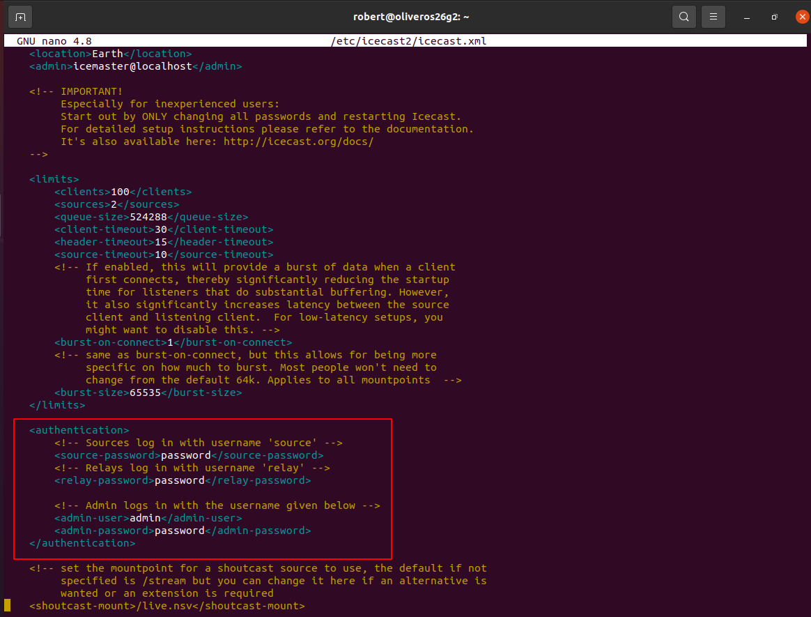

# Instalación y configuración de un Servidor Streaming Multimedia - Linux

***Nombre:*** Zebensui y Robert

***Curso:*** 2º de Ciclo Superior de Administración de Sistemas Informáticos en Red.

### ÍNDICE

- [Introducción](#id1)
- [Descargar e Instalar IceCast](#id2)
  - [Editar fichero /etc/icecast/icecast2.xml](#id2.1)
  - [Editar fichero /etc/default/icecast](#id2.2)
- [Descargar codificador vorbis ices2](#id3)
  - [Editar fichero /etc/ices2/ices-playlist.xml](#id3.1)
- [Ficheros de audio en formato ogg](#id4)
- [Comprobaciones](#id5)

#### ***Introducción***. 

Siguiendo los pasos detallados en las guías y tutoriales proporcionados, vamos a instalar un servicio de audio orientado a una emisión de radio música.
Para ello utilizaremos el servidor de audio `IceCast` y el codificador `ices2`.

#### ***Descargar e Instalar IceCast***. 

-  `apt-get install icecast2`, para descargar el paquete IceCast.  

>Nos saltará un pop-up de instalación del servicio.

Le decimos que si para continuar con la configuración, aunque podríamos hacerlo de manera manual, lo que realmente está sucediendo es que el programa escribe por nosotros ciertos datos delicados en el archivo de configuración que después vamos a manipular para otros datos.

- Definimos un nombre para el servidor (`miempresa.com`)

- Definimos la contraseña de varias utilidades del servicio como `"password"`

- Una vez salgamos del pop-up finalizará la descarga.

- Iniciamos el servicio

###### ***Editar fichero /etc/icecast/icecast2.xml***. 

Definimos la contraseña y usuario que usaremos, en este caso estaban definidas por la configuración previa.

###### ***Editar fichero /etc/default/icecast***. 

- Añadimos la línea `ENABLE=true` al archivo.

#### ***Descargar codificador vorbis ices2***. 

-` apt-get install ices2`, para instalar el codificador.

- Creamos el directorio para el codificador y copiamos el fichero de configuración por defecto.

> Ahora la ruta del archivo pasa a ser: `/etc/ices2/ices-playlist.xml`

###### ***Editar fichero /etc/ices2/ices-playlist.xml***. 

Editamos el fichero de configuración del codificador y establecemos los parámetros de nuestra emisora mediante las etiquetas que se han remarcado en rojo.

#### ***Ficheros de audio en formato ogg***. 

Ahora necesitamos algún que otro fichero de audio en formato `ogg`, la manera más fácil es pasar un audio de Youtube a MP3 y de MP3 a OGG.

Esto es un proceso muy sencillo, ya que existen múltiples convertidores que hay por internet.

**Youtube -> MP3**

**MP3 -> OGG**

- Recopilamos los ficheros en `/tmp/música`

>En la imagen podemos ver como movemos dos archivos ogg al directorio /tmp/música

- `find /tmp/música –iname “*.ogg” > /etc/icecast2/playlist.txt`, para general la lista de reproducción.

-  `mkdir /var/log/ices2`, creamos el directorio log de ices2
-  `ices2 /etc/ices2/ices-playlist.xml &`, ejecutamos el codificador

***DISCLAIMER -*** El error que aparece sucede porque en el archivo de configuración de icecast2 viene por defecto como ruta log: `/var/log/ices` en lugar de `/var/log/ices2`. Debemos ir a cambiarlo manualmente.

Una vez solucionado, volvemos a ejecutar el codificador:

Siempre es recomendable resetear el servicio cuando hemos hecho cambios:

#### ***Comprobaciones***. 

- Accedemos via web al servicio (`nombre/direccion de servidor:8000`)

> Como se puede apreciar solo nos muestra una parte de la información.

- Para acceder como admin escribimos `/admin` al final de la URL

- En la página de Admin Home nos muestran los "`Global Server Stats`", donde principalmente tenemos estadisticas de control.

> Por ejemplo, conexiones de clientes, oyentes, localización, cuando inicio el servidor, etc.

- En el home también encontramos el apartado de "`Mountpoint`", en nuestro caso llamado "radiostation".

- Aqui vemos informacion mas orientada a los ficheros de audios que tenemos, cuantos channels, es decir, pistas de audio hay dentro del servidor (en nuestro caso 2), la ip que tendrán que usar los usuarios para acceder, la calidad de escucha, etc...

- Accedemos al `/mountpoint` desde servidor y un cliente.

> Hemos comprobado que existe una reproducción del streaming de audio que hemos creado y funciona perfectamente.

#### ***Investigación (Darwin Streaming Server)***. 

**Darwin Streaming Server**

**Que es?**

`Darwin Streaming Server` es la versión libre de QuickTime Streaming Server. Existe en versión para Linux y es de un uso muy simple, así que puede ser una opción muy interesante.

Si, por ejemplo, quieres montarte tu «radio on line» en una red local, para tus compañeros de trabajo o de clase, puedes hacerlo. Si quieres compartir vídeos en streaming con instrucciones y tutoriales también podrás. Podrías hasta hacerte tu youtube personal.

**Link de descarga**

https://github.com/macosforge/dss/releases/download/6.0.3/StreamingProxy-6.0.3-MacOSX.tar

**Funcionamiento**

Para su funcionamiento hay que darle permisos a algunas carpetas de ejecución e iniciar el servicio como otro cualquiera: `/etc/init.d/darwin-streaming-server start`

El servicio trabaja con el `puerto 1220`, asi que para configurarlo basta con ir a localhost:1220.

Una vez dentro veríamos algo tal que asi:

Para probar el funcionamiento se puede utilizar audios de testeo que se encuentran en la ruta (`/usr/local/movies`), aqui es donde deberemos mover los archivos que queramos usar dentro del servidor.

**NOTA** Los archivos de audio tiene que ser compatibles con RTSP

Para probarlo simplemente ponemos la ruta: `rtsp://servername-or-ip-address/archivo-de-prueba`

**Archivos de configuración destacables**

`/usr/local/sbin/Darwin Streaming Server` —- Server Software

`/usr/local/sbin/streamingadminserver.pl` —- Web Frontend

`/etc/streaming` —- Configuration Directory

`/etc/streaming/streamingserver.xml` —- Configuration File

`/var/streaming/logs` —- Logs

`/usr/local/movies` —- Default media directory
