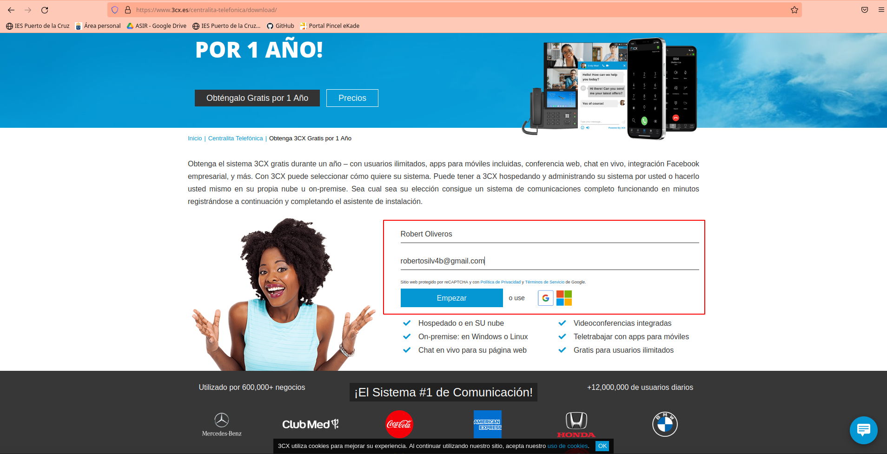
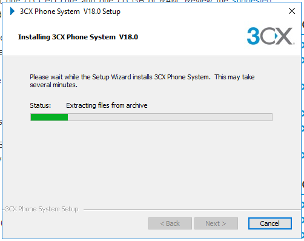
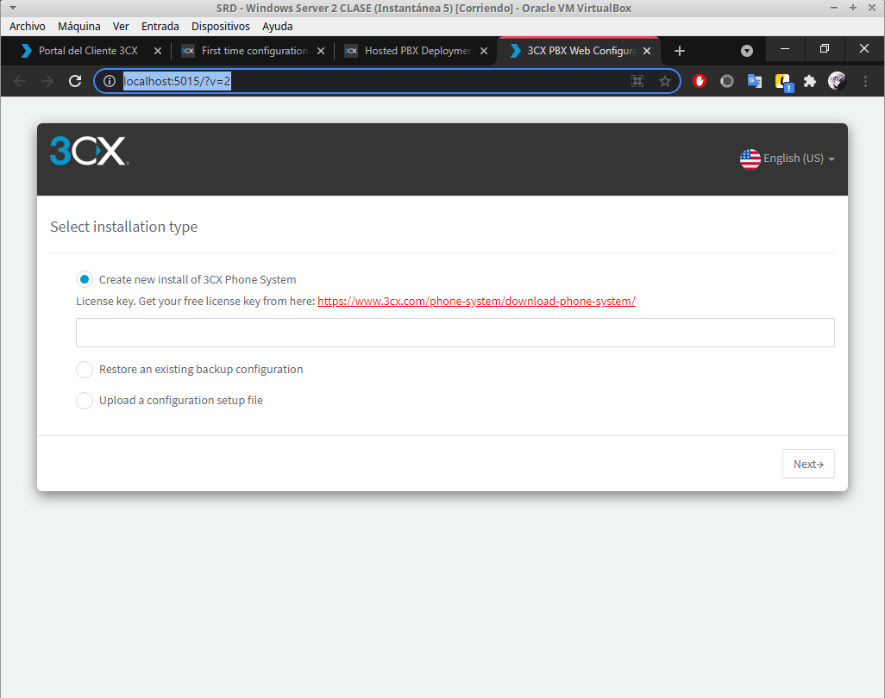
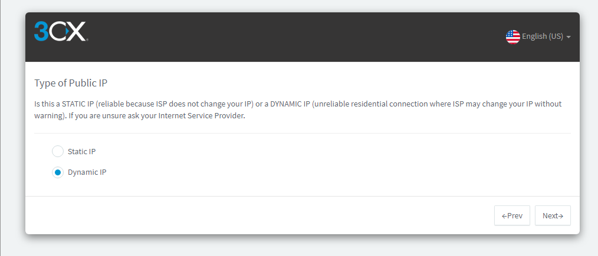

# Instalación y configuración de un Servidor de VoIP sobre Windows 2016

***Nombre:*** Robert Oliveros y Zebensui Lorenzo

***Curso:*** 2º de Ciclo Superior de Administración de Sistemas Informáticos en Red.

### ÍNDICE

+ [Introducción](#id1)
+ [3CX Phone System](#id2)
+ [Usuarios Movil](#id3)
  + [Comprobaciones Movil-Movil](#id3.1)
+ [Conclusiones](#id5)

#### ***Introducción***. 

Siguiendo los pasos detallados en las guías y tutoriales proporcionados, instalar y
configurar un servidor y un cliente para establecer comunicaciones de voz mediante el
servicio VoIP (Voice Over Internet Protocol) sobre sistemas Windows.

Plantearemos una practica sobre VoIP en Windows utilizand 3CX Phone System, una distribución GNU/Linux especializada basada en Debian, creada por 3CX, diseñada para correr una plataforma completa de comunicaciones unificada, basada en el software de PBX.

#### ***3CX Phone System***. 

La idea es registrarnos, configurar y descargar el software de 3CX Phone System, para ello utilizaremos una MV Windows Server.

- Nos creamos una nueva cuenta desde su pagina oficial: http://www.3cx.es/

Una vez dentro del panel de nuestra suscripcion, marcamos que no queremos hacer un backup.

Marcamos la opcion de "Local" ya que desde esta es donde podremos configurar nosotros mismos todos los datos importantes, la otra opcion seria que los hospedaran ellos, ofrecen 1 año gratis, pero perderia la gracia de la practica.

Definimos un hostname cualquiera, en nuestro caso, parte del dominio del Windows Server.

Descargamos el ejetucable de instalacion para Windows.

Completamos una instalacion normal y basica:

Justo despues de la imagen anterior, se abre una consola que nos pregunta como preferimos configurar nuestro servicio, desde la consola o via Web, yo he documentado la parte Web, pero al haber tenido problemas durante la practica probe el otro metodo y es practicamente igual que este que mostrare a continuacion.

Primero nos pide la License Key que la tenemos en nuestro panel de perfil.

Definimos un usuario y su contraseña.

Comprobamos que nuestra IP publica sea la que nos muestra y aceptamos en nuestro caso que esta en lo cierto.

Marcamos que nuestra IP Publica es dinamica para que el servicio detecte cada vez que iniciemos la maquina que IP estamos usando.

Dejamos los puertos que vienen por defecto, los mas importantes para nosotros seran el 5000 y 5001 que son HTTP y HTTPS respectivamente.

Seleccionamos el adaptador de red que este conectado a la red local y utilizamos el FQDN de nuestro controlador de Dominio Active Directory.

Seleccionamos que la extensiones funcionen con 3 digitos.

Definimos un correo para el admin, este recibira notificaciones por actualizacion, fallos en el sistema, intentos de hackeo...

Definimos nuestro Pais y Zona horaria.

Configuramos los datos del operador, se le suele dar por defecto la extension 100 que es con la que podra acceder al sercicio.

Nos llega un correo como el que veran a continuacion donde nos da informacion sobre el usuario, ademas de una contraseña unica e intrasferible.

Seleccionamos el pais en el que trabajaremos y en el cual las llamadas seran realizadas.

Seleccionamos el idioma en el que funcionara el servicio.

Y por ultimo, registro de datos personales como cuenta administrador.

Ya tendriamos nuestro servicio de 3CX levantado.

***DISCLAIMER*** - Hay que tener mucho cuidado con los servicios de Windows, hay que asegurarse de que estan bien levantados y que las dependecias de ellos estan tambien activas, muchos hay que levantarlos por primera vez de manera manual, y fue un fallo que ocurrio mucho en clase.

Iniciamos sesion, ya sea con el nombre o la extension del operador.

#### ***Usuarios Movil***. 

Una vez dentro del panel de control, vamos al apartado de usuarios para agregarlos.

*Cuando los agregamos tenemos que añadir un numero de telefono y escanear el QR que aparece con nuestro dispositivo movil, esto hara que el perfil se nos ponga en verde*

> Cuando escaneamos el QR nos aparece el usuario que ahora representamos(El usuario con extension 100) listo para hacer llamadas y recibirlas.

Lo hacemos con otro movil para un segundo usuario, y obviamente con diferente numero de telefono.

> Vemos que en el movil nos aparece tanto nuestro nuevo usuario(Ext 101) como otro usuario que no somos nosotros pero que esta disponible para hacerle una llamada, mandar mensaje, etc.

##### ***Comprobaciones Movil-Movil***. 

Llamada del usuario (101) al usuario (100)

    > >        > >      

#### ***Conclusiones***. 
