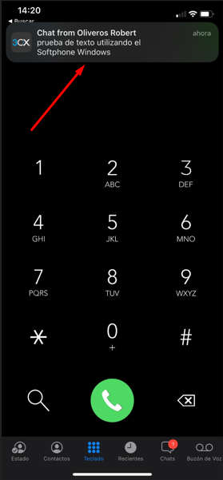

# Instalación y configuración de un Servidor de VoIP sobre Windows 2016

***Nombre:*** Zebensui Lorenzo y Robert Oliveros

***Curso:*** 2º de Ciclo Superior de Administración de Sistemas Informáticos en Red.

### ÍNDICE

+ [Introducción](#id1)
+ [3CX Phone System](#id2)
+ [Clientes Movil](#id3)
  + [Comprobaciones Movil-Movil](#id3.1)
+ [Cliente Windows](#id4)
  + [Comprobaciones Windows-Movil](#id4.1)
+ [Conclusiones](#id5)

#### ***Introducción***. 

Siguiendo los pasos detallados en las guías y tutoriales proporcionados, instalar y
configurar un servidor y un cliente para establecer comunicaciones de voz mediante el
servicio `VoIP` (Voice Over Internet Protocol) sobre sistemas Windows.

Plantearemos una práctica sobre VoIP en Windows utilizand `3CX Phone System`, una distribución GNU/Linux especializada basada en Debian, creada por 3CX, diseñada para correr una plataforma completa de comunicaciones unificada, basada en el software de PBX.

#### ***3CX Phone System***. 

La idea es registrarnos, configurar y descargar el software de `3CX Phone System`, para ello utilizaremos una MV Windows Server.

- Nos creamos una nueva cuenta desde su página oficial: http://www.3cx.es/

Una vez dentro del panel de nuestra suscripción, marcamos que no queremos hacer un backup.

Marcamos la opción de "`Local`", ya que desde esta es donde podremos configurar nosotros mismos todos los datos importantes, la otra opción seria que los hospedaran ellos, ofrecen 1 año gratis, pero perdería la gracia de la práctica.

Definimos un hostname cualquiera, en nuestro caso, parte del dominio del Windows Server.

Descargamos el ejecutable de instalación para Windows.

Completamos una instalación normal y básica:

Justo después de la imagen anterior, se abre una consola que nos pregunta como preferimos configurar nuestro servicio, desde la consola o vía Web, yo he documentado la parte Web, pero al haber tenido problemas durante la práctica probé el otro método y es prácticamente igual que este que mostraré a continuación.

Primero nos pide la `License Key` que la tenemos en nuestro panel de perfil.

Definimos un usuario y su contraseña.

Comprobamos que nuestra IP pública sea la que nos muestra y aceptamos en nuestro caso que está en lo cierto.

Marcamos que nuestra IP Pública es dinámica para que el servicio detecte cada vez que iniciemos la máquina que IP estamos usando.

Dejamos los puertos que vienen por defecto, los más importantes para nosotros serán el 5000 y 5001 que son `HTTP` y `HTTPS` respectivamente.

Seleccionamos el adaptador de red que esté conectado a la red local y utilizamos el FQDN de nuestro controlador de Dominio Active Directory.

Seleccionamos que las extensiones funcionen con `3 dígitos`.

Definimos un correo para el admin, este recibirá notificaciones por actualización, fallos en el sistema, intentos de hackeo...

Definimos nuestro Pais y Zona horaria.

Configuramos los datos del operador, se le suele dar por defecto la extensión `100` que es con la que podrá acceder al servicio.

Nos llega un correo como el que verán a continuación donde nos da información sobre el usuario, además de una contraseña única e intransferible.

Seleccionamos el país en el que trabajaremos y en el cual las llamadas serán realizadas.

Seleccionamos el idioma en el que funcionara el servicio.

Y por último, registro de datos personales como cuenta administrador.

Ya tendríamos nuestro servicio de 3CX levantado.

***DISCLAIMER*** - Hay que tener mucho cuidado con los servicios de Windows, hay que asegurarse de que están bien levantados y que las dependencias de ellos están también activas, muchos hay que levantarlos por primera vez de manera manual, y fue un fallo que ocurrió mucho en clase.

Iniciamos sesión, ya sea con el nombre o la extensión del operador.

#### ***Clientes Movil***. 

Una vez dentro del panel de control, vamos al apartado de usuarios para agregarlos.

*Cuando los agregamos tenemos que añadir un número de teléfono y escanear el QR que aparece con nuestro dispositivo movil, esto hará que el perfil se nos ponga en verde*

> Cuando escaneamos el QR nos aparece el usuario que ahora representamos(El usuario con extensión 100) listo para hacer llamadas y recibirlas.

Lo hacemos con otro móvil para un segundo usuario, y obviamente con diferente número de teléfono.

> Vemos que en el móvil nos aparece tanto nuestro nuevo usuario(Ext 101) como otro usuario que no somos nosotros pero que está disponible para hacerle una llamada, mandar mensaje, etc.

##### ***Comprobaciones Móvil-Móvil***. 

**Llamada del usuario (101) al usuario (100)**

           

Comprobamos en el panel de control el registro de una llamada en curso:

  

Probamos a hacer videollamada entre ambos:

    

**Llamamos al buzón de voz**

**Mensajes entre los clientes**

     

Iniciamos sesión en el webclient con alguno de los clientes, en este caso el cliente(100) y comprobamos la mensajería de texto.

#### ***Cliente Windows***. 

Para el uso del cliente Windows (`3CX Windows Desktop App`) tenemos que darle a la pestaña con el icono de Windows que aparece en el webclient.

Descargamos el instalador de cliente.

Se nos abrirá una ventana y nos da unas indicaciones, el programa nos pide que le volvamos a dar al icono Windows, pero esta vez para sincronizar la cuenta que estamos usando en el webclient, con la aplicación de Windows.

#### ***Comprobaciones Windows-Móvil***. 

***DISCLAIMER*** - Para que funcione la acción de realizar llamadas hay que habilitar en la MV un micrófono, si no lo hacemos, nos saltara un error de micrófono no encontrado que cancelara la acción.

**Llamada del usuario (100) en cliente Windows al usuario (101) que opera en el móvil.**

Probamos la videollamada, en este caso el cliente móvil utiliza su cámara y está enfocando a la pantalla donde se ve el cliente Windows.

**Probamos a llamar del cliente móvil (101) al cliente Windows (100)**

> Vemos como nos aparece la llamada en curso en el panel.

**Dejamos un mensaje en el contestador**

La llamada anterior no la vamos a responder y el cliente móvil(101) dejará un mensaje de voz en el buzón del cliente (100), comprobamos que aparece:

> Podemos escucharlo, descargarlo, llamar de vuelta o borrarlo.

**Mensajes entre cliente Windows y móvil**

#### ***Conclusiones***. 

Nos hubiera gustado darle más uso al servicio porque nos parece superinteresante, pero la falta de tiempo, diversos problemas que surgieron al principio y los problemas de internet que hubo en clase nos ha hecho limitar un poco las utilidades documentadas. Aun así hemos descubierto mucho sobre el servicio y el VoIP.
